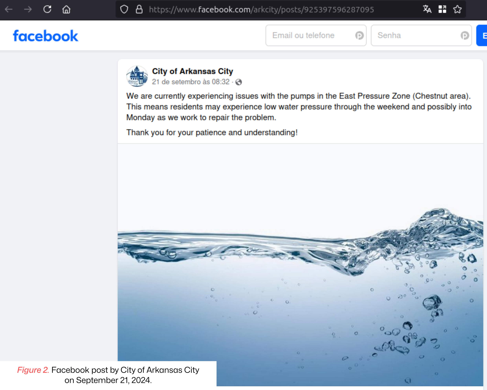

# 📰 Issue 01: Threat Actors Continue to Exploit OT/ICS through Unsophisticated Means

The Cybersecurity & Infrastructure Security Agency (CISA) continues to respond to the ongoing exploitation of Internet-facing industrial control systems (ICS) and operational technology (OT) environments, with a particular focus on the water and wastewater systems (WWS) sector. The exposure of vulnerable applications may enable cyber threat actors to conduct operations using default credentials, perform brute-force attacks, or employ other unsophisticated tactics, techniques, and procedures (TTP) to gain access to these devices and cause harm. Within this context, a cybersecurity incident involving a water treatment facility in the City of Arkansas City is discussed in this issue.

**🛠️ MITRE ATT&CK for ICS Table**

> [!CAUTION]
> The analyses presented in this document are limited to information primarily disseminated through news reports and institutional press releases, and may lack detail and accuracy.

| Tactics                                                            | Techniques                                                                            | Procedures                                                                               |
| ------------------------------------------------------------------ | ------------------------------------------------------------------------------------- | ---------------------------------------------------------------------------------------- |
| TA0108-[Initial access](https://attack.mitre.org/tactics/TA0108)   | T0886-[Remote services](https://attack.mitre.org/techniques/T0886/)                   | Adversaries may have leveraged remote services through the VNC protocol.                 |
| TA0104-[Execution](https://attack.mitre.org/tactics/TA0104/)       | T0823-[Graphical user interface](https://attack.mitre.org/techniques/T0823/)          | Adversaries may have gained access to the GUI of OT devices.                             |  
| TA0109-[Lateral movement](https://attack.mitre.org/tactics/TA0109) | T0812-[Default credentials](https://attack.mitre.org/techniques/T0812/)               | Adversaries may have discovered and exploited default credentials of OT devices.         |
| TA0105-[Impact](https://attack.mitre.org/tactics/TA0105/)          | T0828-[Loss of productivity and revenue](https://attack.mitre.org/techniques/T0828)   | Ransomware incident impacting consumers.                                                 |
| TA0105-[Impact](https://attack.mitre.org/tactics/TA0105/)          | T0829-[Loss of view](https://attack.mitre.org/techniques/T0829)                       | Adversaries may have caused a loss of view of ICS equipment, requiring manual operation. |

## 🕵️‍♂️ Cybersecurity Incident Summary

This alert from CISA was released shortly after the City of Arkansas City, Kansas, [reported](https://www.arkcity.org/environmental-services/page/city-arkansas-city-faces-cybersecurity-incident) that a cybersecurity incident occurred on the morning of September 22, 2024, which required the manual operation of the water treatment plant as a precautionary measure. The day before, the municipal administration had announced via [Facebook](https://www.facebook.com/arkcity/posts/925397596287095) that the pumps in the Chestnut area were experiencing technical issues, and that residents might face low water pressure throughout the weekend.

This cybersecurity incident occurred two days after the Water Information Sharing and Analysis Center (WaterISAC) released an alert about pro-Russian hacktivists targeting water and wastewater utilities. There are suspicions that the attack was a ransomware type, as [reported](https://www.waterisac.org/portal/incident-awareness-%E2%80%93-ransomware-attackers-target-kansas-water-treatment-facility) by WaterISAC. According to a [report](https://www.kwch.com/video/2024/09/23/arkansas-city-water-plant-hit-by-cyberattack-over-weekend/) by KWCH 12 News, an employee noticed that a computer was not functioning properly and displayed a message on the screen with a contact email and ransom demands, typical of a ransomware attack.

In general, ICS and OT devices in WWS are accessible via the Internet through the virtual network computing (VNC) protocol, which, by default, uses port 5900. This protocol is used for remote access to graphical user interfaces (GUI), including human-machine interfaces (HMI) of programmable logic controllers (PLC). Additionally, ICS and OT devices in WWS may be exposed to the corporate intranet without proper isolation and protection.

Until now, there is no indication that malicious actors gained access to the OT systems. However, the incident highlights the risks associated with vulnerable WWS, which could allow adversaries to manipulate OT systems and, consequently, sabotage the safe and clean production of water.

On September 18, 2024, the U.S. Environmental Protection Agency (EPA) [released](https://www.cisa.gov/resources-tools/resources/epa-guidance-improving-cybersecurity-drinking-water-and-wastewater-systems) guidelines for WWS to evaluate their cybersecurity practices to minimize attack risks. Some priority practices include:

- Maintain an up-to-date inventory of all OT and IT assets, including IP addresses, third-party equipment, and legacy systems.
- Identify and apply patches to vulnerabilities in critical assets as soon as possible, and to other assets within a risk-informed timeframe.
- Change all default passwords before putting any equipment or software into service.
- Implement a minimum password length policy through administrative controls or system settings.
- Require separate and unique credentials for users to access OT and IT networks, reducing the risk of attackers moving between networks with a single login.
- Segment OT and IT networks and deny connections to OT networks by default unless explicitly allowed. Use firewalls, bastion hosts, jump boxes, or demilitarized zones (DMZs) as part of this segmentation.
- Require multi-factor authentication (MFA) whenever possible, especially for remote access to OT systems within WWS.
- Use email security controls to mitigate threats such as spoofing and phishing.
- Disable Microsoft Office macros or similar embedded code on all assets.
- Regularly back up systems necessary for operations (such as network configurations and PLC logic). Maintain three copies of backups (one primary and two additional), store backups on different media than the source, and keep one copy offsite.
- Develop an incident response plan for various cybersecurity events.
- Collect security logs, such as system/network access and malware detections, for use in incident identification and investigations.
- Eliminate exposed ports and Internet-facing services, such as touchscreens used for monitoring and controlling systems or HMIs of PLCs, through regular reviews.
- Establish an allowlist that permits only IP addresses from authorized devices.
- Practice and maintain the ability to operate WWS manually.

## 📚 References

- Cybersecurity and Infrastructure Security Agency. (2024, May 1). *Defending OT Operations Against Ongoing Pro-Russia Hacktivist Activity*. [Link](https://www.cisa.gov/resources-tools/resources/defending-ot-operations-against-ongoing-pro-russia-hacktivist-activity)
- U.S. Environmental Protection Agency. (2024, September 18). *EPA Guidance on Improving Cybersecurity at Drinking Water and Wastewater Systems* (EPA 817-B-23-001). [Link](https://www.cisa.gov/resources-tools/resources/epa-guidance-improving-cybersecurity-drinking-water-and-wastewater-systems)
- City of Arkansas City. (2024, September 22). *City of Arkansas City Faces Cybersecurity Incident*. [Link](https://www.arkcity.org/environmental-services/page/city-arkansas-city-faces-cybersecurity-incident)
- KWCH 12 News. (2024, September 23). *Arkansas City Water Plant Hit by Cyberattack Over Weekend* [Video]. [Link](https://www.kwch.com/video/2024/09/23/arkansas-city-water-plant-hit-by-cyberattack-over-weekend/)
- Gatlan, S. (2024, September 24). *Kansas Water Plant Cyberattack Forces Switch to Manual Operations*. Bleeping Computer, Security. [Link](https://www.bleepingcomputer.com/news/security/kansas-water-plant-cyberattack-forces-switch-to-manual-operations/)
- KWCH 12 News. (2024, September 24). *Arkansas City Working to Get Water Treatment Plant Back Online After Cyberattack* [Video]. [Link](https://www.kwch.com/video/2024/09/24/arkansas-city-working-get-water-treatment-plant-back-online-after-cyberattack/)
- Waldman, A. (2024, September 24). *Arkansas City Water Treatment Facility Hit by Cyberattack*. TechTarget, News. [<link>](https://www.techtarget.com/searchsecurity/news/366611812/Arkansas-City-water-treatment-facility-hit-by-cyberattack)
- Water Information Sharing and Analysis Center. (2024, September 24). *Incident Awareness: Ransomware Attackers Target Kansas Water Treatment Facility*. [Link](https://www.waterisac.org/portal/incident-awareness-%E2%80%93-ransomware-attackers-target-kansas-water-treatment-facility)
- Cybersecurity & Infrastructure Security Agency. (2024, September 25). *Threat Actors Continue to Exploit OT/ICS through Unsophisticated Means*. [Link](https://www.cisa.gov/news-events/alerts/2024/09/25/threat-actors-continue-exploit-otics-through-unsophisticated-means)

**🔖 Nomenclature**

- DMZ: Demilitarized zone.
- GUI: Graphical user interface.
- HMI: Human-machine interface.
- ICS: Industrial control system.
- IP: Internet protocol.
- IT: Information technology.
- MFA: Multi-factor authentication.
- OT: Operational technology.
- PLC: Programmable logic controller.
- TTP: Tactics, techniques, and procedures.
- VNC: Virtual network computing.
- WWS: Water and wastewater system.

---

*Ind.Cyber.Sec Letters* . Issue 01 . 2024-10-10

[Prof. Dr. Luiz F. Freitas-Gutierres](https://www.linkedin.com/in/lffreitas-gutierres/)