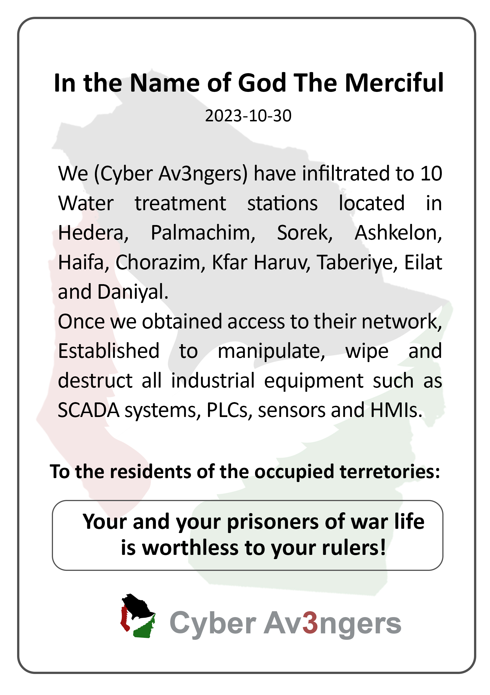

# 📰 Issue 02: OpenAI Identifies Threat Actors Using Its AI Models Against Operational Technologies

The increasing adoption of artificial intelligence (AI) has heightened concerns in the field of cybersecurity due to the various ways cybercriminals can exploit it to pose threats, cause damage, and gain financial advantage. On the other hand, defense professionals and law enforcement agencies can also utilize AI tools to enhance cybersecurity by automating data analysis, implementing predictive detection systems, and combating illicit activities in the cyber environment.

In October 2024, OpenAI published a [report](https://cdn.openai.com/threat-intelligence-reports/influence-and-cyber-operations-an-update_October-2024.pdf?is=46e0b4e762c0efeca5e232b23baf28a76896b8c8dbf7a5019e28c872940ca0a4) on the monitoring of cyber operations conducted by malicious actors using ChatGPT and other AI tools. This approach enabled both the disruption of illicit activities and the collection of cyber threat intelligence (CTI) on tactics, techniques, and procedures (TTP), as well as potential targets. The case studies presented in the report include malware debugging, writing articles for websites, producing content for dissemination on social media by fake accounts, and other activities. Additionally, malicious actors used ChatGPT to generate phishing lures and create filenames capable of evading security filters.

Based on analyses conducted by OpenAI, several accounts were banned, policy violations were assessed, and mechanisms were implemented to block certain commands in ChatGPT and other AI tools. Furthermore, CTI was shared with the aim of strengthening defenses against emerging threats.

## 🕵️‍♂️ General Notes

- Threat actors frequently utilize OpenAI's AI models during the intermediate stages of cyber operations, after the reconnaissance phase and before executing techniques such as distributing phishing emails, deploying malware, or posting on social media platforms.
- According to OpenAI, there is no evidence indicating significant advancements in adversaries' abilities to create new malware that is substantially different or to exploit real-world vulnerabilities using ChatGPT.
    - Despite this, AI models can be employed to enhance targeted attacks by ensuring that their execution only when the intended target is present, thereby avoiding detection by concealing itself within benign applications. An example of this is the [DeepLocker](https://thehackernews.com/2018/08/artificial-intelligence-malware.html) malware, whose capabilities were enhanced by AI.
    - As highlighted in a [report](https://www.europol.europa.eu/media-press/newsroom/news/new-report-finds-criminals-leverage-ai-for-malicious-use-%E2%80%93-and-it%E2%80%99s-not-just-deep-fakes) by Trend Micro Research, in collaboration with Europol and the United Nations Interregional Crime and Justice Research Institute (UNICRI), another example of AI usage is [AVPASS](https://github.com/sslab-gatech/avpass/tree/master). This tool can infer the detection rule chain of antivirus software, allowing malware to be disguised as benign applications on Android devices.
        - The same [report](https://www.europol.europa.eu/media-press/newsroom/news/new-report-finds-criminals-leverage-ai-for-malicious-use-%E2%80%93-and-it%E2%80%99s-not-just-deep-fakes) also highlights the use of AI to optimize password-guessing algorithms.
- Content generated with the assistance of AI tools was monitored in relation to the 2024 elections and democratic processes, with a focus on the United States and the Republic of Rwanda, and to a lesser extent, India and European Union countries. However, in 2024, no cases were identified in which OpenAI's AI models demonstrated a concrete ability to generate viral engagement or cultivate a mobilized audience. Cyber influence operations were assessed as having limited ability to reach real individuals on the internet, as categorized under level 2 of the [Brookings' Breakout Scale](https://www.brookings.edu/articles/the-breakout-scale-measuring-the-impact-of-influence-operations/).
    - Despite this, ChatGPT accounts were banned for generating election-related content.
- The 2023 Inside the Mind of a Hacker [report](https://www.bugcrowd.com/blog/inside-the-mind-of-a-hacker-2023-edition/) by Bugcrowd indicates that 64% of hackers incorporate generative AI into their cyber activities. In the same year, the World Economic Forum [highlighted](https://www.weforum.org/agenda/2023/01/davos23-generativeai-technology-artificial-intelligence/) the effectiveness of phishing emails crafted and personalized with the assistance of ChatGPT, noting their improved clarity, grammatical accuracy, and tailoring to the recipients' profiles. Furthermore, AI enables phishing attacks to be executed more quickly and at a larger scale, as observed by Schneier and Raghavan in their [analysis](https://www.wired.com/story/large-language-model-phishing-scams/).
- The use of AI tools can reduce the need for human involvement in cybercriminal organizations, particularly in the development of malicious software and fraudulent activities. Consequently, this decreases the demand for recruiting new members, leading to lower operational costs and minimizing exposure in Dark Web forums or anonymous channels, as [discussed](https://blog.talosintelligence.com/the-rise-of-ai-powered-criminals/) by Tiziakouris.

## 🏭 Notes on OT and ICS Security

- The OpenAI [report](https://cdn.openai.com/threat-intelligence-reports/influence-and-cyber-operations-an-update_October-2024.pdf?is=46e0b4e762c0efeca5e232b23baf28a76896b8c8dbf7a5019e28c872940ca0a4) discusses the group [Cyber Av3ngers (G1027)](https://attack.mitre.org/groups/G1027/), reportedly affiliated with the Islamic Revolutionary Guard Corps (IRGC). This group has been using AI models to conduct research on programmable logic controllers (PLCs). The report highlights observed activities, including reconnaissance, inquiries about usernames and default passwords for various PLCs, intentions to obfuscate malicious code, and questions on using well-known penetration testing tools. Additionally, requests were made for assistance in creating and refining scripts in Bash and Python, as well as general information on companies and vulnerabilities.
- OpenAI details the activities of Cyber Av3ngers, categorizing them according to the large language model (LLM)-themed TTP from the MITRE ATT&CK framework.

| Activity | LLM-themed TTP from the MITRE ATT&CK framework |
| ----- | ----- |
| Request for a list of routers commonly used in Jordan | LLM-Informed reconnaissance |
| Request for a list of industrial protocols and ports potentially connected to the Internet | LLM-Informed reconnaissance |
| Inquiry about the default password for a [Tridium](https://www.tridium.com/us/en) device | LLM-Informed reconnaissance |
| Request for username and default password for a [Hirschmann](https://www.belden.com/products/by-brand/hirschmann) router | LLM-Informed reconnaissance |
| Request for information on vulnerabilities in [CrushFTP](https://www.crushftp.com/index.html), [Cisco IMC](https://www.cisco.com/c/en/us/products/collateral/servers-unified-computing/ucs-b-series-blade-servers/data_sheet_c78-728802.html), and [Asterisk](https://www.asterisk.org/products/software/) | LLM-Informed reconnaissance |
| Request for a list of electric sector companies and PLCs commonly installed in Jordan | LLM-Informed reconnaissance |
| Question about why a Bash script returns an error | LLM-Enhanced scripting techniques |
| Request for the creation of a Modbus TCP/IP client | LLM-Enhanced scripting techniques |
| Request for a network scan to identify vulnerabilities | LLM-Assisted vulnerability research |
| Request for a scan of ZIP files to identify vulnerabilities | LLM-Assisted vulnerability research |
| Request for source code example in C for process hollowing | LLM-Assisted vulnerability research |
| Inquiry about how to obfuscate VBA scripts in Microsoft Excel | LLM-Enhanced anomaly detection evasion |
| Request for assistance in obfuscating malicious code | LLM-Enhanced anomaly detection evasion |
| Question on how to copy a SAM file | LLM-Assisted post-compromise activity |
| Inquiry about an alternative to [mimikatz](https://github.com/ParrotSec/mimikatz) | LLM-Assisted post-compromise activity |
| Question on how to use [pwdump](https://github.com/d0v0e/pwdump8) to export a password | LLM-Assisted post-compromise activity |
| Question on how to access user passwords on macOS | LLM-Assisted post-compromise activity |

### Cyber Av3ngers (G1027)

{:height 219, :width 269.25}

- With significant attacks dating back to 2023, Cyber Av3ngers is a group that typically targets SCADA, PLC, and industrial control systems (ICS) systems, particularly within water and wastewater systems (WWS), energy systems, and the broader manufacturing sector. The group primarily focuses on companies associated with Israel, the United States, or Ireland. Its operations emphasize causing damage to internet-connected devices manufactured by Israeli companies. There are suspicions that Cyber Av3ngers is linked to another IRGC-associated group, the Soldiers of Solomon. Additionally, Cyber Av3ngers is also known by variations of its name, such as CyberAv3ngers, CyberAveng3rs, and Cyber Avengers.
- This APT group's campaigns frequently exploit default passwords and widely documented PLC CVEs within the cybersecurity community, as well as free and open-source software (FOSS) for reconnaissance and exploitation of ICS. However, some alleged compromises of critical infrastructure in Israel attributed to the group have been proven false.
- Notably, a 2023 campaign ([C0031](https://attack.mitre.org/campaigns/C0031)) targeted Unitronics PLCs and HMIs, resulting in the defacement of these devices' user interfaces, as illustrated in the images below (the first [published](https://www.unitronicsplc.com/) by JNS and credited to Geller & Harod; the second [featured](https://www.cbsnews.com/pittsburgh/news/municipal-water-authority-of-aliquippa-hacked-iranian-backed-cyber-group/) by CBS News and credited to the Municipal Water Authority of Aliquippa), with the insertion of anti-Israel comments. The confirmed successful attacks primarily targeted WWS in Israel and the United States.

{:height 461, :width 558}

{:height 461, :width 558}

- In general, the compromised devices were [Unitronics Vision series PLCs](https://www.unitronicsplc.com/programmable-controllers-vision-series/), which were exposed to the Internet with default passwords on TCP port 20256. Following the incident, [CVE-2023-6448](https://nvd.nist.gov/vuln/detail/CVE-2023-6448) was published, addressing this type of cyberattack.
- Cyber Av3ngers maintains a [profile on X](https://x.com/CyberAveng3rs) (formerly known as Twitter), where they have previously announced the compromise of water treatment facilities.

{:height 697.5, :width 491.625}

- Cyber Av3ngers also claims responsibility for:
    - Attacks on Israel's railway infrastructure.
    - Attacks on Israel's electric sector, allegedly causing a blackout.
    - Distributed denial of service (DDoS) attacks on the website of an oil refinery.
    - Attacks on servers, security cameras, and smart urban management systems in Israel.
        - However, some of these claims were later [assessed](https://www.dragos.com/blog/cyber-av3ngers-hacktivist-group-targeting-israel-made-ot-devices/) as false.

**🛠️ MITRE ATT&CK TTP of Cyber Av3ngers**

> [!CAUTION]
> The analyses presented in this document are based primarily on information disseminated through technical reports, news outlets, and institutional press releases, and may therefore lack comprehensive detail and accuracy.

| Tactics | Techniques | Procedures |
| ----- | ----- | ----- |
| TA0043-[Reconnaissance](https://attack.mitre.org/tactics/TA0043/) | T1595-[Active scanning](https://attack.mitre.org/techniques/T1595) | Conducting active scans to identify OT devices accessible via the Internet. |
| TA0042-[Resource development](https://attack.mitre.org/tactics/TA0042/) | T1583-[Acquire access](https://attack.mitre.org/techniques/T1650) | Potential purchase of access to compromised target systems. |
| TA0006-[Credential access](https://attack.mitre.org/tactics/TA0006/) | T1110-[Brute force](https://attack.mitre.org/techniques/T1110) | Use of brute-force techniques to obtain target login credentials |
| TA0006-[Credential access](https://attack.mitre.org/tactics/TA0006/) | T1552-[Unsecured credentials](https://attack.mitre.org/techniques/T1552) | Exploitation of default passwords |
| TA0040-[Impact](https://attack.mitre.org/tactics/TA0040/) | T1485-[Data destruction](https://attack.mitre.org/techniques/T1485) | Compromise and damage to critical systems |

## 📚 References

- Kumar, M. (2018, August 09). *Researchers Developed Artificial Intelligence-Powered Stealthy Malware*. The Hacker News. [<link>](https://thehackernews.com/2018/08/artificial-intelligence-malware.html)
- Nimmo, B. (2020, September). *The Breakout Scale: Measuring the Impact of Influence Operations*. Brookings, Foreign Policy. [<link>](https://www.brookings.edu/articles/the-breakout-scale-measuring-the-impact-of-influence-operations/)
- Trend Micro Research. (2021, December 06). *Malicious Uses and Abuses of Artificial Intelligence*. Europol's European Cybercrime Centre, United Nations Interregional Crime and Justice Research Institute. [<link>](https://www.europol.europa.eu/publications-events/publications/malicious-uses-and-abuses-of-artificial-intelligence)
- Dor, D. (2023, January 15). *It's up to us to Determine if Generative AI Helps or Harms our World*. World Economic Forum, Opinion. [<link>](https://www.weforum.org/agenda/2023/01/davos23-generativeai-technology-artificial-intelligence/)
- Schneier, B., & Raghavan, B. (2023, April 4). *Brace Yourself for a Tidal Wave of ChatGPT Email Scams*. WIRED, Ideas. [<link>](https://www.wired.com/story/large-language-model-phishing-scams/)
- JNC. (2023, April 10). *Cyber Attack Shutters Galilee Farm Water Controllers*. Update Desk. [<link>](https://www.jns.org/cyberattack-shutters-galilee-farm-water-controllers/)
- National Institute of Standards and Technology. (2023, May 12). *CVE-2023-6448*. Information Technology Laboratory, National Vulnerability Database. [<link>](https://nvd.nist.gov/vuln/detail/CVE-2023-6448)
- Sharma, A. (2023, July 30). *Israel's Largest Oil Refinery Website Offline After DDoS Attack*. BleepingComputer, News, Security. [<link>](https://www.bleepingcomputer.com/news/security/israels-largest-oil-refinery-website-offline-after-ddos-attack/)
- Dark Reading. (2023, July 31). *Website of Israeli Oil Refinery Taken Offline by Pro-Iranian Attackers*. Cyberattacks & Data Breaches. [<link>](https://www.darkreading.com/cyberattacks-data-breaches/israeli-oil-refinery-taken-offline-pro-iranian-attackers)
- Tziakouris, G. (2023, August 14). *The Rise of AI-Powered Criminals: Identifying Threats and Opportunities*. Talos, On the Radar. [<link>](https://blog.talosintelligence.com/the-rise-of-ai-powered-criminals/)
- Bugcrowd. (2023, September 15). *Inside the Mind of a Hacker (ITMOAH): Security in the Age of Generative AI*. [<link>](https://www.bugcrowd.com/blog/inside-the-mind-of-a-hacker-2023-edition/)
- Veeneman, P. (2023, October 12). *Digital Battlegrounds: Evolving Hybrid Kinetic Warfare*. Industrial Cyber. [<link>](https://industrialcyber.co/analysis/digital-battlegrounds-evolving-hybrid-kinetic-warfare/)
- Stanish, E. (2023, November 26). *Municipal Water Authority of Aliquippa Hacked by Iranian-Backed Cyber Group*. CBS News, Crime. [<link>](https://www.cbsnews.com/pittsburgh/news/municipal-water-authority-of-aliquippa-hacked-iranian-backed-cyber-group/)
- Cybersecurity and Infrastructure Security Agency. (2023, November 28). *Exploitation of Unitronics PLCs Used in Water and Wastewater Systems*. Alert. [<link>](https://www.cisa.gov/news-events/alerts/2023/11/28/exploitation-unitronics-plcs-used-water-and-wastewater-systems#:~:text=CISA%20is%20responding%20to%20active,at%20a%20U.S.%20water%20facility.)
- Cybersecurity and Infrastructure Security Agency. (2023, December 01). *IRGC-Affiliated Cyber Actors Exploit PLCs in Multiple Sectors, Including U.S. Water and Wastewater Systems Facilities*. Cybersecurity Advisory. [<link>](https://www.cisa.gov/news-events/cybersecurity-advisories/aa23-335a)
- Dragos. (2023, July 12). *Cyber Av3ngers Hacktivist Group Targeting Israel-Made OT Devices*. Blog. [<link>](https://www.dragos.com/blog/cyber-av3ngers-hacktivist-group-targeting-israel-made-ot-devices/)
- Tasnim News Agency. (2023, September 16). *Israeli Rail System Comes Under Cyberattack*. Politics News. [<link>](https://www.tasnimnews.com/en/news/2023/09/16/2956946/israeli-rail-system-comes-under-cyberattack)
- SOCRadar. (2023, December 22). *Dark Web Profile: Cyber Av3ngers*. Blog. [<link>](https://socradar.io/dark-web-profile-cyber-av3ngers/)
- Microsoft Threat Intelligence. (2024, February 14). *Staying Ahead of Threat Actors in the Age of AI*. Blog, Threat Intelligence. [<link>](https://www.microsoft.com/en-us/security/blog/2024/02/14/staying-ahead-of-threat-actors-in-the-age-of-ai/)
- MITRE ATT&CK. (2024, April 10). *Cyber Av3ngers*. Groups, ID G1027. [<link>](https://attack.mitre.org/groups/G1027/)
- Nimmo, B., & Flossman, M. (2024, October). *Influence and Cyber Operations: An Update*. OpenAI. [<link>](https://cdn.openai.com/threat-intelligence-reports/influence-and-cyber-operations-an-update_October-2024.pdf?is=46e0b4e762c0efeca5e232b23baf28a76896b8c8dbf7a5019e28c872940ca0a4)

**🔖 Nomenclature**

- AI: Artificial intelligence.
- CTI: Cyber threat intelligence.
- DDoS: Distributed denial of service.
- FOSS: Free and open-source software.
- HMI: Human-machine interface.
- ICS: Industrial control system.
- LLM: Large language model.
- PLC: Programmable logic controller.
- OT: Operational technology.
- SCADA: Supervisory control and data acquisition.
- TCP: Transmission control protocol.
- TTP: Tactics, techniques, and procedures.
- WWS: Water and wastewater system.

---

*Ind.Cyber.Sec Letters* . Issue 02 . 2024-10-17

[Prof. Dr. Luiz F. Freitas-Gutierres](https://www.linkedin.com/in/lffreitas-gutierres/)