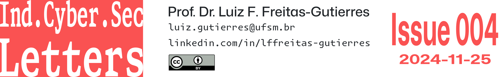
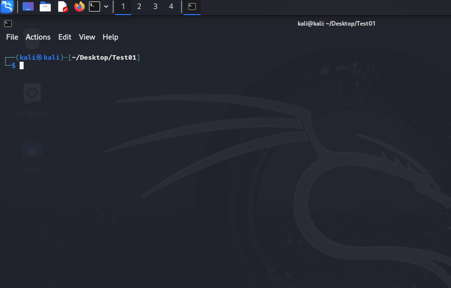

# 📰 Issue 04: Weak Passwords and Poor Security Practices Persist After Six Years of NordPass Research

The [annual edition of NordPass's Research Insights (2024)](https://nordpass.com/most-common-passwords-list/?is=46e0b4e762c0efeca5e232b23baf28a76896b8c8dbf7a5019e28c872940ca0a4), conducted in collaboration with NordStellar, analyzed a 2.5 TB database sourced from public repositories and malicious origins, including the Dark Web, across 44 countries. According to NordPass, the dataset was anonymized prior to analysis. Furthermore, an examination of email domains allowed researchers, in most cases, to differentiate between personal and corporate credentials.

The findings from NordPass and NordStellar identified the **200 most commonly used passwords** among users. Additionally, the results highlight that, broadly speaking, individuals continue to rely on passwords that are easily guessed or cracked.

## 🔑 The 15 Most Common Passwords

- 👎 `123456`
- 👎 `123456789`
- 👎 `12345678`
- 👎 `password`
- 👎 `qwerty123`
- 👎 `qwerty1`
- 👎 `111111`
- 👎 `12345`
- 👎 `secret`
- 👎 `123123`
- 👎 `1234567890`
- 👎 `1234567`
- 👎 `000000`
- 👎 `qwerty`
- 👎 `abc123`

## 🔑 The 15 Most Common Corporate Passwords

- 👎 `123456`
- 👎 `123456789`
- 👎 `12345678`
- 👎 `secret`
- 👎 `password`
- 👎 `qwerty123`
- 👎 `qwerty1`
- 👎 `111111`
- 👎 `123123`
- 👎 `1234567890`
- 👎 `qwerty`
- 👎 `1234567`
- 👎 `11111111`
- 👎 `abc123`
- 👎 `iloveyou`

## 🔑 The 15 Most Common Passwords in Brazil

- 👎 `123456`
- 👎 `qwerty123`
- 👎 `qwerty1`
- 👎 `123456789`
- 👎 `12345678`
- 👎 `12345`
- 👎 `102030`
- 👎 `admin`
- 👎 `Brasil`
- 👎 `Qwerty123`
- 👎 `1234567`
- 👎 `Qwerty1!`
- 👎 `Qwerty123!`
- 👎 `Qwerty12`
- 👎 `Qwerty1234`

## 📝 General Report Notes

- A significant similarity is observed between the most vulnerable personal and corporate passwords, indicating that individuals often reuse credentials.
- According to the [report](https://nordpass.com/most-common-passwords-list/?is=46e0b4e762c0efeca5e232b23baf28a76896b8c8dbf7a5019e28c872940ca0a4) by NordPass, no substantial improvements have been observed in password creation and usage habits over the six years since the publication of Research Insights.
- The [Research Insights: Top 200 Most Common Passwords](https://nordpass.com/most-common-passwords-list/?is=46e0b4e762c0efeca5e232b23baf28a76896b8c8dbf7a5019e28c872940ca0a4) by NordPass provides the following recommendations:
    - 1️⃣ Create strong passwords.
        - 🪪 Passwords should be at least 20 characters long.
        - 🪪 Passwords should include a combination of uppercase letters (`ABCD...`), lowercase letters (`abcd...`), numbers (`0123...`), and special characters (`*%@...`).
        - 🙅 Passwords should not contain predictable information, such as birthdays (`YYYYMMDD`, `DDMMYY`), names (`FirstNameLastName`, `LastName`, `FirstName`), or common words (`secret`, `password`, `admin`, `Brazil`).
            - Examples of strong password practices:
                - 👍 `2jO3*%syQ9pa4@Ma85rT`
                - 👍 `{gyT46*@>uEz4?|oId2\`
    - 2️⃣ Regularly assess passwords for vulnerabilities or reuse.
    - 3️⃣ Avoid reusing passwords across multiple sites or services.
    - 4️⃣ Replace weak passwords with stronger and more secure alternatives.
    - 5️⃣ Utilize password managers.
    - 6️⃣ Adopt passkeys instead of conventional passwords.

## 🪪 Notes on Minimum Password Requirements

- In accordance with the draft version of the [Digital Identity Guidelines](https://www.nist.gov/news-events/news/2024/08/nist-releases-second-public-draft-digital-identity-guidelines-final-review) released by the National Institute of Standards and Technology (NIST) in August 2024, credentials must meet the following standards from the perspective of verifiers and credential service providers (CSP):
    - 🔒 Contain at least 15 characters.
    - 🔒 Allow all [printable ASCII characters](https://www.ascii-code.com/characters/printable-characters), including spaces.
    - 🔒 Support Unicode characters, in compliance with the [ISO/IEC 10646:2020 standard](https://www.iso.org/standard/76835.html).
    - 🙅 Avoid strict composition rules, such as requiring a mix of different character types (contrary to the recommendations [suggested](https://nordpass.com/most-common-passwords-list/?is=46e0b4e762c0efeca5e232b23baf28a76896b8c8dbf7a5019e28c872940ca0a4) by NordPass).
- The Cybersecurity & Infrastructure Security Agency (CISA) [recommends](https://www.cisa.gov/secure-our-world/use-strong-passwords) the following practices:
    - 🔒 Use passwords with a minimum of 16 characters.
    - 🔒 Create random passwords by employing:
        - A combination of uppercase and lowercase letters, numbers, and symbols.
        - Passphrases composed of four to seven unrelated words, such as:
            - 👍 `HorseBankSchoolTangleOceanCircumferenceJeans`
            - 👍 `Horse Bank School Tangle Ocean Circumference Jeans` (with spaces between words).
    - 🔒 Ensure that each password is unique for every account.
    - 🔒 As [advocated](https://nordpass.com/most-common-passwords-list/?is=46e0b4e762c0efeca5e232b23baf28a76896b8c8dbf7a5019e28c872940ca0a4) by NordPass, use a password manager.
- The Federal Bureau of Investigation (FBI), similar to the aforementioned entities, [emphasizes](https://www.ic3.gov/CSA/2024/241104.pdf) the importance of adopting appropriate measures to mitigate cyber incidents, with a particular focus on using secure credentials. Additionally, the FBI recommends the following:
    - 🔒 Disable "hints" for password recovery.
    - 🔒 Implement automatic account lockouts after multiple failed login attempts.
    - 🔒 Avoid requiring frequent password changes (more than once per year), except in cases where compromise is suspected or confirmed.
        - 🕵️ Frequent password changes increase the likelihood of users adopting predictable patterns that can be easily cracked by malicious actors.
    - 🔒 Ensure the replacement of all default passwords in both hardware and software.
    - 🔒 Implement multi-factor authentication (MFA) for all services where this functionality is available.

## ☠️ Risks of Weak Passwords and Poor Security Practices

1. ⚔️ Brute-force attacks.
    - 🗡️ Dictionary-based attacks.
        - 💀 Dictionaries contain predefined lists of common words, phrases, and number combinations. These lists are used in automated routines to systematically compare passwords against victims' credentials.
        - 💀 Weak and easily memorable passwords are particularly susceptible to this type of attack and are often quickly compromised.
        - 💻 The following demonstration simulates a scenario in which an adversary attempts to crack the password `111111`, represented in hash format ([SHA-512](https://en.wikipedia.org/wiki/SHA-2)).

    - 🗡️ Public information-based attacks.
        - 💀 Cybercriminals may collect personal data, such as names, birthdays, and other information obtained from social media platforms, to craft personalized attacks.
        - 💀 Similar to dictionary-based methods, this information is incorporated into wordlists to execute targeted attacks against specific victims.
    - 🗡️ Exhaustive attacks.
        - 💀 In this method, all possible combinations of characters are tested until the password is discovered. While effective against short passwords, its efficiency is significantly reduced when targeting long and complex passwords.
        - 💻 A simulation was conducted to illustrate the process of cracking the password `abc123`, represented as a hash ([SHA-512](https://en.wikipedia.org/wiki/SHA-2)), using the exhaustive brute-force method. The results showed that the password was cracked in just four seconds.
2. ⚔️ Phishing.
    - 💀 Even complex passwords are vulnerable to social engineering attacks. In this context, the use of passkeys is recommended as a replacement for traditional passwords.
    - 💀 It is crucial to enable and integrate MFA with available services, as well as implement support for fast IDentity online ([FIDO](https://fidoalliance.org/)) standards.
3. ⚔️ Data breaches.
    - 💀 The exposure of passwords or confidential data during data breach incidents significantly increases the risk of cyberattacks, especially if passwords are reused across multiple services.

## 📚 References

- Cybersecurity & Infrastructure Security Agency. (2024). *Use Strong Passwords*. Secure Our World. [Link](https://www.cisa.gov/secure-our-world/use-strong-passwords)
- Nord Security. (2024). *NordPass Research Insights 2024: Top 200 Most Common Passwords*. [Link](https://nordpass.com/most-common-passwords-list/?is=46e0b4e762c0efeca5e232b23baf28a76896b8c8dbf7a5019e28c872940ca0a4)
- National Institute of Standards and Technology. (2024). *Digital Identity Guidelines* (NIST SP 800-63-4 2pd). [Link](https://doi.org/10.6028/NIST.SP.800-63-4.2pd)
- National Institute of Standards and Technology. (2024). *Digital Identity Guidelines: Identity Proofing and Enrollment* (NIST SP 800-63A-4 2pd). [Link](https://doi.org/10.6028/NIST.SP.800-63A-4.2pd)
- National Institute of Standards and Technology. (2024). *Digital Identity Guidelines: Authentication and Authenticator Management* (NIST SP 800-63B-4 2pd). [Link](https://doi.org/10.6028/NIST.SP.800-63B-4.2pd)
- National Institute of Standards and Technology. (2024). *Digital Identity Guidelines: Federation and Assertions* (NIST SP 800-63C-4 2pd). [Link](https://doi.org/10.6028/NIST.SP.800-63C-4.2pd)
- Federal Bureau of Investigation. (2024, November 4). *Easy Access to Information for Conducting Fraudulent Emergency Data Requests Impacts US-Based Companies and Law Enforcement Agencies* (Private Industry Notification, 20241104-001). Cyber Division, Internet Crime Complaint Center. [Link](https://www.ic3.gov/CSA/2024/241104.pdf)
- Singh, A. (2024, November 14). *What Are the Most Commonly Used Passwords in 2024*. Axios, Technology. [Link](https://www.axios.com/2024/11/14/common-passwords-2024-list?is=46e0b4e762c0efeca5e232b23baf28a76896b8c8dbf7a5019e28c872940ca0a4)

**🔖 Nomenclature**

- ASCII: American standard code for information interchange.
- CSP: Credential service providers.
- FIDO: Fast IDentity online.
- MFA: Multi-factor authentication.

---

*Ind.Cyber.Sec Letters* . Issue 04 . 2024-11-25

[Prof. Dr. Luiz F. Freitas-Gutierres](https://www.linkedin.com/in/lffreitas-gutierres/)