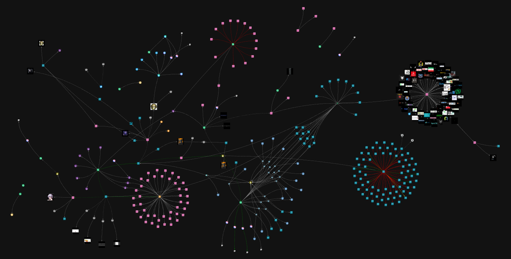

# 📰 CTI-Brief 04: Notes on FunkSec and an Affiliated Threat Actor

This brief presents findings on the [FunkSec](https://www.ransomlook.io/group/funksec) ransomware group, with emphasis on the online activities, behavioral patterns, and indicators associated with the affiliated threat actor `el_farado`.

## 📑 Table of Contents

- [🕵️‍♂️ FunkSec](#️️-funksec).
- [🦹 el_farado](#-el_farado).
- [📚 References](#-references).
- [🔖 Nomenclature](#-nomenclature).

## 🕵️‍♂️ FunkSec

**FunkSec** ([RansomLook](https://www.ransomlook.io/group/funksec), [WatchGuard](https://www.watchguard.com/wgrd-security-hub/ransomware-tracker/funksec)) is a cyber threat group specializing in ransomware operations and hacktivism that gained prominence in 2024, particularly for its use of artificial intelligence (AI) in malicious activities [(Bitdefender, 2025; SOCRadar, 2025)](#-references). The group has developed an AI-driven malware employing intermittent encryption and code obfuscation techniques [(Alamri & Mooney, 2025)](#-references). **FunkSec** typically combines data exfiltration with encryption in a double-extortion model, exerting pressure on victims to pay the demanded ransom [(Bitdefender, 2025)](#-references).

The group operates a ransomware-as-a-service (RaaS) platform, enabling other cybercriminals to leverage its malicious toolset in exchange for payment. As of March 18, 2025, 172 victims have been attributed to **FunkSec**, according to [Ransomware.live](https://www.ransomware.live/group/funksec), spanning multiple sectors and countries. Recent incidents have targeted the communications and water sectors, posing significant risks to critical infrastructure [(Alamri & Mooney, 2025)](#-references).

**FunkSec** also benefits from affiliations with other ransomware groups and online personas, including some linked to [FSociety](https://www.ransomlook.io/group/fsociety) and [Bjorka](https://www.ransomlook.io/group/babuk-bjorka) [(Bitdefender, 2025; SOCRadar, 2025)](#-references).

Figure 01 provides an overview of the **FunkSec** investigation conducted using the [StealthMole](https://www.stealthmole.com)'s platform, with emphasis on the digital footprint of one of the actors involved in the malicious activities: `el_farado`. Key findings regarding this threat actor are outlined in the following section.

  
   
  <em>Figure 01. Overview of the FunkSec investigation highlighting the 'el_farado' footprint.</em>

## 🦹 el_farado

- 💬 **Telegram**.
    - Username: `fr_farado` (Farado Solo 📀). Bio: *Operator TITA*. User ID: `73******84`.
        - Channel title: `Fr********s2`. Channel ID: `24******10`.
            - Message `24******10_**`: *[ACTION] Farado joined the group* (on February 16, 2025).
        - Channel title: `Th*******zi`. Channel ID: `18******89`.
            - Message `18******89_******`: *HOLA* (on June 15, 2025). 
    - Username: `el_farado` (farado solo).
- 💬 **Keybase**: [keybase.io/el_farado](https://keybase.io/el_farado).
- 💬 **X/Twitter**.
    - Username: [@EFarado](https://x.com/EFarado).
    - Display name: `el_farado`.
    - Bio: *HOLA hermosa!! Cartel de Internet y Manteniéndose Vivo e Interesado en el Ciberespacio*.
    - Location: Mexico.
    - Join date: February, 2025.
- 💬 **Session ID**: `0538d726ae**********************************************dbea9efb3d`.
- 💬 **qTox**: `3D84BC32DF********************************************************306AF53DC4`.
- 🪙 **Bitcoin Wallets**.
    - `bc1q68a9lw**********************4jytr0hlrc`.
        - Transactions totaling 0.06894754 BTC (approximately USD 8,456.75) were recorded between January 10 and July 16, 2025, with incoming and outgoing amounts being equivalent.
    - `bc1qnswpvr**********************sq2flaywv5`.
- 👥 **BreachForums**: `user_304312`, `el_farado`.

  
   
  <em>Figure 02. Profile pictures of the cybercriminal. Left: Telegram, X/Twitter, and Keybase. Right: BreachForums and FunkSec onion sites.</em>

### 🔍 StealthMole's Government Monitoring:

- Source: `breachforums.st`
- Bad-actor: `el-farado`.
- Leak title: *Bangladesh Navy Database*. (2024, December 7).

### 🔍 StealthMole's Leaked Monitoring

- Source: `breachforums.st`.
- Username: `el_farado`.
- 🗄️ **Archived activities**.
    1. *Home Credit +1,000 Consumer Call Logs Leaks!*. (2024, September 11).
    2. *noidaauthorityonline.com database leak 1.2GB*. (2024, September 17).
    3. *What you guys do with leaked info*. (2024, September 17).
    4. *Corporates SMTP access*. (2024, November 21).
    5. *styched.in leak | Download*. (2024, November 23).
    6. *intbizth.com leak | Download*. (2024, November 24).
    7. *x-cart.com leak | Download*. (2024, November 24).
    8. *[REPOST] Olympic Qatar leak | Download*. (2024, November 25).
    9. *Hess International Educational Group leak | Download*. (2024, December 1).
    10. *xui.one Leak | Download*. (2024, December 1).
    11. *albazaar.shop shopping site leak | Download*. (2024, December 3).
    12. *Council for Scientific and Industrial Research leak | Download*. (2024, December 3).
    13. *Immobilière Essaouira real estate agency leak | Download*. (2024, December 3).
    14. *altuslab.com Leak | Download*. (2024, December 5).
    15. *edizionidottrinari.it leak | Download*. (2024, December 5).
- 📝 **Notes**.
    - Joined `breachforums.st` in September 2024.
    - Records 1-2-3-4 contain no direct references to **FunkSec**.
    - Starting from record 5, there are explicit mentions of the threat group.
    - Posts, such as in record 6, include forum signatures indicating a connection between the users `el_farado`, `Desertstorm`, and `blako`, with the latter two also linked to **FunkSec** operations.
    - Beginning with record 4, `el_farado` used an avatar depicting Pablo Escobar from the Narcos Netflix series (Figure 02).
    - In record 3, `el_farado` posted: <pre>Hey fellow hackers, I'm curious to know how you handle leaked information like NAME EMAIL ADDRESS PHONE NUMBER. leak databases what it lead</pre> technical reports and investigative analyses have interpreted this as an indication that the persona may be a novice or possess only intermediate knowledge in conducting malicious activities.
    - The Spanish word *hola* appears with relative frequency in forum posts, as well as in a post on X/Twitter and in a Telegram message (`18******89_******`), which will be discussed in greater detail later. As an example, in record 4, `el_farado` stated: <pre>As PoW I will send 'HOLA!' from these address to your given mail address</pre>

### 🔍 Additional Observations via StealthMole's Platform

- In a `BozKurtlar` thread dated November 12, 2024, at `https://breachforums.st/Thread-BozKurtlar-hacker-*****-*******-****-************`, `el_farado` responded with a lengthy text mimicking a news broadcast, using the expression:<pre>THE HOLA TIMES</pre>
    - In a January 10, 2025, thread at `https://breachforums.st/Thread-I-****-**-****-**-*`, a similar expression was written by `el_farado`:<pre>HOLA TIME's</pre>
- In a thread created by `el_farado`on November 17, 2024, at `https://breachforums.st/Thread-I-****-**-****`, the malicious actor stated:<pre>I wanna learn hacking Website and Databases ( SQL injection, Using CVE to hack ). Like how other guys posting leaks. What should I look for?</pre> This message supports researchers' suspicions that the cybercriminal is still developing technical skills and leveraging pre-built tools and exploits [(Check Point Research, 2025)](#-references).
- Similarly, on September 23, 2024, `el_farado` wrote:<pre>I'm curious to know buying databases from sellers forum. What type of databases are you consider to pay for (email lists, customer data, market research, etc.)? What factors do you consider when evaluating a database for purchase (data accuracy, completeness, relevance, price, etc.)?</pre>
- Also on September 23, 2024, `el_farado` posted:<pre>logging in BF from ClerNet should I?? Should I be logging in BF from my real IP. This will give BF my IP could I trust BF to protect that or TRUST NOBODY?</pre>
- The word *hola* and variations of *mamaa* are frequently used. The online persona’s vocabulary also includes recurrent use of racially derogatory terms, such as *n***** (5-word).
- The post identified on March 24, 2025, at `https://breachforums.st/Thread-S******-Paraguay-*-*******-*******-****` offered for sale Paraguay’s 2023 voter database, containing approximately 7 million citizen records, including sensitive personal data, addresses, dates of birth, and other information [Schwartz, 2025](#-references). `el_farad` requested payment of USD 10,000 in BTC/XMR and provided contact details via Telegram (`fr_farado`) and qTox (`3D84BC32DF********************************************************306AF53DC4`).
    - `el_farado` also shared samples of this leak via the link `https://gofile.io/*/******` in the X/Twitter post at `https://x.com/EFarado/status/1929***********5905`.
- In a post dated March 28, 2025, at `https://breachforums.st/Thread-Telecommunications-******-Arizona-******-******-**-*******`, `el_farado` offered access to the Supportboard chat system and the corporate email account of a telecommunications company headquartered in Arizona, United States. Contact details were provided via Telegram (`fr_farado`) and qTox (`3D84BC32DF********************************************************306AF53DC4`).
- On November 14, 2024, in response to a thread at `https://breachforums.st/Thread-What-did-you-*****-*****-****-*****`, `el_farado` wrote:<pre>Man I was fighting in war for my country and then somehow I'm on Colombia street selling drugs, and suddenly fallen from a building</pre>
    - Considering the frequent use of the word *hola*; references to Colombia (as in the above message) and Mexico (listed as the location in the user’s profile, as well as mentioned in the X/Twitter post at `https://x.com/EFarado/status/1936***********7553`); and the entirely Spanish-language biography in the X/Twitter profile [@EFarado](https://x.com/EFarado), there is a working hypothesis that `el_farado` may be a Spanish speaker. However, this hypothesis should be approached with caution, as such indicators could be intentionally fabricated by the cybercriminal.

## 📚 References

- Alamri, A. H., & Mooney, L. (2025, May 5). *Dragos Industrial Ransomware Analysis: Q1 2025*. Dragos. [Link](https://www.dragos.com/blog/dragos-industrial-ransomware-analysis-q1-2025)
- Bitdefender. (2025, March 4). *FunkSec: An AI-Centric and Affiliate-Powered Ransomware Group*. Blog, Threat Research. [Link](https://www.bitdefender.com/en-us/blog/businessinsights/funksec-an-ai-centric-and-affiliate-powered-ransomware-group)
- Check Point Research. (2025, January 10). *FunkSec — Alleged Top Ransomware Group Powered by AI*. [Link](https://research.checkpoint.com/2025/funksec-alleged-top-ransomware-group-powered-by-ai)
- RansomLook. (2025, March 19). *Funksec*. [Link](https://www.ransomlook.io/group/funksec)
- Schwartz, M. J. (2025, June 25). *Ransomware Group Threatens to Dump Paraguayan Citizens' Data*. GovInfoSecurity. [Link](https://www.govinfosecurity.com/ransomware-group-threatens-to-dump-paraguayan-citizens-data-a-28686)
- SOCRadar. (2025, January 28). *Dark Web Profile: FunkSec*. Blog, Threat Actor Profiles. [Link](https://socradar.io/dark-web-profile-funksec)
- WatchGuard. (2025). *Ransomware - FunkSec*. [Link](https://www.watchguard.com/wgrd-security-hub/ransomware-tracker/funksec)

## 🔖 Nomenclature

- AI: Artificial intelligence.
- RaaS: Ransomware-as-a-service.

  
   
  <em>Artwork for CTI-Brief 04, Volume 02 of the Ind.Cyber.Sec Letters.</em>

*Ind.Cyber.Sec Letters* . Volume 02 . CTI-Brief 04 . 2025-08-13

[Prof. Dr. Luiz F. Freitas-Gutierres](https://www.linkedin.com/in/lffreitas-gutierres/)