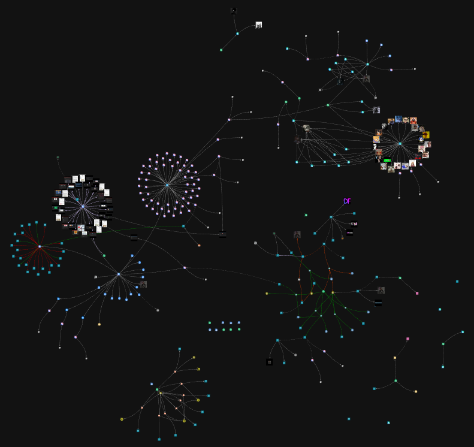
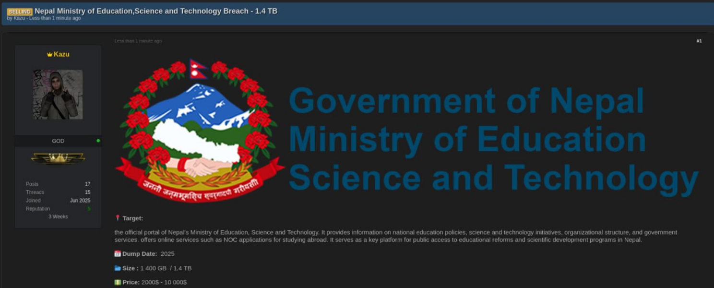
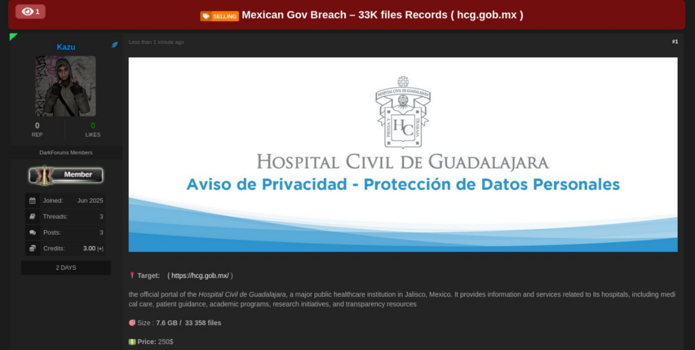

# 📰 CTI-Brief 05: Profiling a Threat Actor Linked to Recent Cyber Incidents in Nepal

This document contains notes on cyber incidents involving the online persona `kazu`, along with an assessment of the subject's digital footprint. Figure 1 provides an overview of the investigations conducted via the [StealthMole](https://www.stealthmole.com/)'s platform.

  
   
  <em>Figure 01. Overview of the investigation, highlighting the digital footprint of 'kazu'.</em>

## 🦹 kazu

- 💬 **Telegram**.
    - Username: `kazu_21` (Kazu). User ID: `82******99`.
    - Channel title: `kazu_breach` (Kazu Breach).
        - Channel ID: `27******71`.
        - 66 archived Telegram messages.
        - 26 deep web URL from [DarkForums](https://darkforums.st).
        - Three active file-hosting links containing leaked data:
            - `https://mega.nz/folder/*******************************` (96.96 GB).
            - `https://mega.nz/file/*********************************************` (9.42 GB).
            - `https://mega.nz/folder/****************************` (1.41 TB).
        - 38 shared images.
        - 13 shared files (12 ZIP and 1 JSON) containing data exfiltration samples from victims.
    - Channel link: `https://t.me/+0ce6J1**********`.
        - Used to disseminate samples of stolen data.
- 💬 **qTox**.
    - `75074B032476DBEEBED1BDE79BA1932B3C9C52AA0E07D421B245117A********************`.
    - `297827C6DBF28D70503A4886901F9AEE5F8AD791BFB08BD337A5EE11********************`.
- 💬 **Session ID**.
    - `05250f372053f9e43817b18e00d9613b1b28******************************`.
    - `05046e743238b6dddfc78ad3fc4c2c12c57f******************************`.
- 💬 **Signal**.
    - `kazu.**1`.
    - `kazu.**7`.
    - `https://signal.me/#eu/OyhV0hfTBwljtpbhJR************************************xsTDx4dpZq`.
    - `https://signal.me/#eu/poUdfuohNO3VY0805P************************************LLNP2uold6`.
- 🔗 **Data breaches via Gofile** (*inactive links*)
    - `https://gofile.io/d/KAhrBB`.
    - `https://gofile.io/d/MnVBws`.
- 🪙 **Monero Wallet**: `44oPp9XrPs89WckSRhFWTM4nW21zfnk2k6qrEQRF9z7GWQmM5LqSfhC****************************************`.
- 👥 **BreachForums**: `user_467***`, `kazu` (joined on December 4, 2025)
- 👥 **DarkForums**: `kazu` (joined on March 2025)
- 👥 **DemonForums**: `kazu` (UID: 122701, joined on July 20, 2025). [Profile](https://web.archive.org/web/20250814212827/http://web.archive.org/screenshot/https://demonforums.net/kazu).
    - *Access for Sale - UK Shop Dashboard*. (2025, August 12). [Link](https://web.archive.org/web/20250814212340/http://web.archive.org/screenshot/https://demonforums.net/Thread-ACCESS-FOR-SALE-%E2%80%93-UK-SHOP-DASHBOARD)
    - *Bolivian Military Social Security Corporation*. (2025, August 11). [Link](https://web.archive.org/web/20250814212300/http://web.archive.org/screenshot/https://demonforums.net/Thread-Bolivian-Military-Social-Security-Corporation-%E2%80%93-COSSMIL-Breach).
    - *700 GB ULP*. (2025, August 8). [Link](https://web.archive.org/web/20250814205729/http://web.archive.org/screenshot/https://demonforums.net/Thread-700-GB-ULP)
    - *Criminal Justice and Public Services - San Luis Potosí Prosecutor Breach ( 34.6 GB )*. (2025, July 25). [Link](https://web.archive.org/web/20250814204633/http://web.archive.org/screenshot/https://demonforums.net/Thread-Criminal-Justice-and-Public-Services-San-Luis-Potos%C3%AD-Prosecutor-Breach-34-6-GB)
    - *Official Job Portal of the Mexican Government Breach - empleo.gob.mx*. (2025, July 25). [Link](https://web.archive.org/screenshot/https://demonforums.net/Thread-Official-Job-Portal-of-the-Mexican-Government-Breach-%E2%80%93-empleo-gob-mx)
- 👤 **Avatar**.

  
   
  <em>Figure 02. Profile image of the cybercriminal.</em>

## 🔍 [StealthMole](https://www.stealthmole.com)'s Government Monitoring

- Bad-actor: `kazu`, `Kazu`, or `kazuu`.
- 🗄️ **Archived activities**.
    1. *Ministry of Health – Government of Sri Lanka | Official Health Portal Breach*. (2025, August 11). `breachforums.st`.
    2. *[FOR SALE] FTP ACCESS – UK GOV SECTOR*. (2025, August 6). `breachforums.st`.
    3. *Nepal Ministry of Education,Science and Technology Breach - 1.4 TB*. (2025, July). `darkforums.st`.
    4. *Nepal Ministry of Education,Science and Technology Breach - 1.4 TB*. (2025, July). `demonforums.net`.
    5. *8 GB sensitive files from Nepal Police center !!!!* (2025, May). `darkforums.st`.
    6. *Nepal Health System Breach - 159,000 Patients Records ( etbregister.ntpmis.gov.np )*. (2025, May). `darkforums.st`.
    7. *[LEAK] Military Fitness Records Breach (evaluacionfisica.armada.mil.bo) 1433996 lines*. (2025, April 13). `breachforums.st`.

## 📝 Notes

- 🚨 The victims of `kazu`'s cyber operations include governmental institutions such as the Ministry of Health of Sri Lanka and the Ministry of Education, Science, and Technology of Nepal. The latter suffered a leak of 1.4 TB of data, disseminated via Telegram channel `27937*****` (message ID: `27937*****_57`). In addition, there is an alleged compromise involving 159,000 patient records from Nepal, as posted on `https://darkforums.st/Thread-Nepal-Health-System-Breach-*********-***-***-********-*******-***********-ntpmis-gov-np` (content hash:  `7b304dd45bb47ee9528f3fb9099d2e83ae8d263240ca********************`).
- 🚨 Other verified potential victims identified during the investigation include:
    - Municipality of Querétaro, Mexico.
    - Government of the State of Zacatecas, Mexico.
    - National Employment Service, Mexico.
    - A Malaysian retail business (name undisclosed).
    - Vehicle Emissions Control, Mexico.
    - GitLab instances belonging to institutions in Indonesia, Argentina, Pakistan, Brazil, and the Bahamas.
    - Bolivian Naval Force, Bolivia.
- Two data breaches attributed to `kazu` were publicly denied by the targeted organizations:
    - 🙅 **Nepal Police Center**: The denial was reported by [TechPana (2025, April 26)](#-references). Following this denial, `kazu` proceeded to publish the data in the forum thread available at `https://darkforums.st/Thread-********-*-**-*********-*****-****-Nepal-Police-center` (Content hash: `94943528f0e8c16f7dc0c73e6721b5c2ffedbda06052********************`).
    - 🙅 **Ministry of Education, Science, and Technology of Nepal**: The denial was reported by [TechPana (2025, July 15)](#-references). In response, `kazu` deliberately leaked 100 GB of the victim's data in the forum thread available at `https://darkforums.st/Thread-********-***-**-****-********-**-Ministry-of-Education-Nepal` (content hash: `4518c440d8ae1bf60c30c9dfff71b61eacf64f0b0cd4********************`).
        - The alleged compromised data are available at `https://mega.nz/folder/****************************`.
- The ransom demands ranged from USD 1,500 to USD 20,000, while the prices for obtaining access to compromised datasets varied between USD 300 and USD 4,000.
- It is suspected that `kazu` may operate under additional online personas on Telegram, including `s*******5`, `k*****1`, `i*******2`, and `l**************0`. However, investigative findings remain inconclusive at this time.
- Although some reports describe `kazu` as a hacker group, this investigation raises the hypothesis that it may in fact be a single individual. This assumption should be treated with caution, and it is evident that the threat actor (even if operating alone) may still receive assistance from others.
- Figures 03 and 04 provide two examples of posts by `kazu` regarding compromises, the latter confirmed by a report from [El Binacional (2025)](#-references).

  
   
  <em>Figure 03. Data exfiltration from the Ministry of Education, Science, and Technology of Nepal.</em>

  
   
  <em>Figure 04. Data exfiltration from Hospital Civil de Guadalajara.</em>

## 📚 References

- El Binacional. (2025, June 25). *Filtran Datos de Pacientes Tras Ciberataque al Hospital Civil de Guadalajara*. [Link](https://web.archive.org/web/20250814231535/https://elbinacional.com/2025/06/filtran-datos-de-pacientes-tras-ciberataque-al-hospital-civil-de-guadalajara/)
- TechPana. (2025, July 15). *शिक्षा मन्त्रालय ह्याक गरेको ‘काजु’ ग्रुपको दाबी, डार्क फोरममा बिक्रीमा राखियो १.४ टीबी डेटा*. [Link](https://web.archive.org/web/20250814230427/https://techpana.com/2025/151854/kazu-group-claims-hacking-education-ministry-1-4tb-data-listed-on-dark-forum)
- TechPana. (2025, April 26). *ह्याक भएको डेटा हाम्रो वेबसाइटको होइन, साइबर क्याफेको होः नेपाल प्रहरी*. [Link](https://web.archive.org/web/20250814230820/https://techpana.com/2025/150554/hacked-data-not-from-our-website-but-from-cyber-cafe-says-nepal-police)

  
   
  <em>Artwork for CTI-Brief 05, Volume 02 of the Ind.Cyber.Sec Letters.</em>

*Ind.Cyber.Sec Letters* . Volume 02 . CTI-Brief 05 . 2025-08-14

[Prof. Dr. Luiz F. Freitas-Gutierres](https://www.linkedin.com/in/lffreitas-gutierres/)