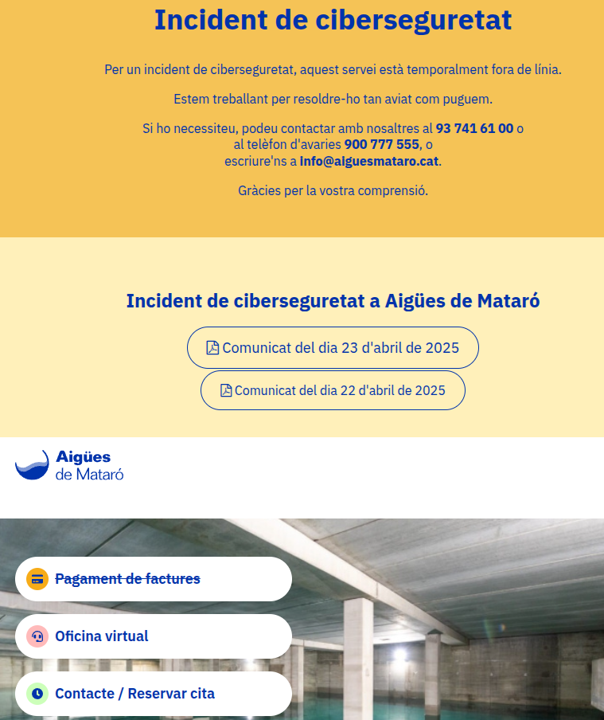

# 📰 Issue 01: Data Breach at Spanish Water Utility Compromises Sensitive Information

This is the first issue of the 2025 volume of the [Ind.Cyber.Sec Letters](https://github.com/substationworm/IndCyberSecLetters/tree/main). As with the inaugural issue of 2024—titled [Threat Actors Continue to Exploit OT/ICS through Unsophisticated Means](https://github.com/substationworm/IndCyberSecLetters/blob/main/2024/Issue01/Issue01.md)—this issue focuses on organizations operating water and wastewater systems (WWS). In particular, it examines the cyber incident affecting the Spanish municipal company [Aigües de Mataró](https://www.aiguesmataro.com/) in April 2025. Given the **compromise of sensitive data**, this issue also includes **notes on data breaches**, drawing especially from the [2025 Data Breach Investigations Report (DBIR) by Verizon](https://www.verizon.com/business/resources/reports/dbir/) and the [2024 Cost of a Data Breach Report by IBM](https://www.ibm.com/reports/data-breach?pStoreID=techsoup/1000gtm.js).

## 📑 Table of Contents

- [🗓️ Incident Timeline](#-incident-timeline).
- [🕵️‍♂️ Cybersecurity Incident Summary](#-cybersecurity-incident-summary).
- [💣 Notes on Data Breaches](#-notes-on-data-breaches).
- [📚 References](#-references).
- [🔍 Supporting Evidences](#-supporting-evidences).

## 🗓️ Incident Timeline

| Date | Event |
|---|---|
| April 21, 2025 | Detection of the cyberattack [(Aigües de Mataró, 2025a)](#-references). |
| April 22, 2025 | Evidence of ransomware activity and leakage of personal and sensitive data [(Aigües de Mataró, 2025b)](#-references). |
| April 25, 2025 | Official communication issued to [Laboratori](https://laboratori.aiguesmataro.com/) customers [(Aigües de Mataró, 2025c)](#-references). |
| April 30, 2025 | Official communication issued to former employees [(Aigües de Mataró, 2025d)](#-references). |
| May 1, 2025 | Ongoing partial service disruptions affecting website functionalities (e.g., bill payment remains unavailable). |
| May 7, 2025 | Continuation of partial service disruptions affecting website functionalities. |

> [!WARNING]  
> The incident remains under investigation and monitoring. Updates will be provided as new information becomes available.

## 🕵️‍♂️ Cybersecurity Incident Summary

- On April 21, 2025, the municipal company [Aigües de Mataró](https://www.aiguesmataro.com/)—based in the city of Mataró, Catalonia, Spain—reportedly suffered a ransomware attack that led to the exposure of consumer data [(2025a)](#-references). The company provides treated water supply and wastewater services to a municipality with an estimated [population of 131,798](https://es.wikipedia.org/wiki/Matar%C3%B3).
- The source of the cyberattack has not been disclosed. However, it affected the municipal company’s information technology (IT) systems and official web portals. As of May 1, 2025, the following websites remained affected, as shown in the figure below:
    - 🔗 https://www.aiguesmataro.com/
    - 🔗 https://laboratori.aiguesmataro.com/
- The company activated a contingency plan to mitigate the impact of the cyber incident and to restore its IT infrastructure. It is also cooperating with Spanish authorities.
- According to Aigües de Mataró [(2025a, 2025b, 2025c)](#-references), the incident did not disrupt the provision of water supply, wastewater services, or the [TubVerd](https://web.archive.org/web/20241110064734/https://tubverd.aiguesmataro.com/es/el-proyecto/que-es) thermal energy network.
- The data breach involved consumer information, as reported by [Aigües de Mataró (2025b)](#-references):
    - 🪪 **Identifying information**: Full names, government-issued ID numbers, dates of birth, signatures, mailing addresses, email addresses, and phone numbers.
    - 🪪 **Personal information**: Details such as tenancy or ownership status and household composition.
    - 🪪 **Financial information**: Bank account numbers.
    - 🪪 **Commercial data**:  Water meter consumption readings.
    - 🪪 **Sensitive information**: Contents of reports assessing the risk of water service disconnection for households in socioeconomic vulnerability, and applications for “social water meters” under social assistance programs.
- The data breach also encompassed information related to former employees [Aigües de Mataró (2025d)](#-references), including:
    - 💼 **Identifying information**: Full names, government-issued ID numbers, dates of birth, signatures, mailing addresses, email addresses, and phone numbers.
    - 💼 **Employment information**: ob titles, work history, and records of working hours.
    - 💼 **Education**: Academic qualifications, professional certifications, resumes, and work experience.
    - 💼 **Geolocation**: Geolocation data from company-assigned vehicles.
    - 💼 **Financial information**: Payroll records and bank account numbers.
    - 💼 **Other data**: Union affiliation and disability status.
- 💀 [Aigües de Mataró (2025c)](#-references) warned customers of the potential for threat actors to exploit the leaked data through **phishing emails**, **smishing** (SMS-based phishing), or **fraudulent phone calls**.

  
   
  <em>Figure 01. Affected website as of May 01, 2025.</em>

## 💣 Notes on Data Breaches

- **Personally identifiable information (PII)** refers to any data that can be used to identify an individual. This includes, but is not limited to:
    - 📇 Full name.
    - 📇 Date of birth.
    - 📇 Residential address.
    - 📇 Email address.
    - 📇 Phone number.
    - 📇 IP address.
- **Sensitive personally identifiable information (SPII)** is a specific subset of PII that includes highly confidential data such as:
    - 📛 Government-issued ID numbers.
    - 📛 Social Security numbers (in the United States).
    - 📛 Financial information (e.g., bank account details).
    - 📛 Medical records.
    - 📛 Biometric data (e.g., facial recognition, fingerprints).
- The theft of SPII can result in more severe consequences and greater harm to affected individuals than the compromise of standard PII.

---

### 💣 Key Findings from Industry Reports

- 💸 The [2025 Data Breach Investigations Report (DBIR) by Verizon](https://www.verizon.com/business/resources/reports/dbir/) analyzed 12,195 data breaches that occurred between November 1, 2023, and October 31, 2024. As appears to have been the case at the municipal company Aigües de Mataró, ransomware (with or without encryption) was involved in 44% of cases.
    - 64% of victim organizations did not pay any ransom to the attackers.
    - The **median ransom payment** to ransomware groups was **USD 115,000**.
- 💸 The [2024 Cost of a Data Breach Report by IBM](https://www.ibm.com/reports/data-breach?pStoreID=techsoup/1000gtm.js), which analyzed 604 organizations affected by data breaches between March 2023 and February 2024, reported an **average breach cost of USD 4.88 million**. This figure includes losses from operational downtime, customer churn, incident response, and other related impacts.
    - When detected by internal security teams: **USD 4.55 million**  
    - When disclosed by the attacker: **USD 5.53 million**
    - The **average costs of extortion-related attacks** were:
        - **Destructive attacks**: USD 5.68 million (e.g., data deletion, system destruction).
        - **Data exfiltration**: USD 5.21 million (e.g., data theft and extortion).
        - **Ransomware**: USD 4.91 million (e.g., data encryption with ransom demand).
- According to [Verizon’s 2025 DBIR](https://www.verizon.com/business/resources/reports/dbir/), **human factors** contributed to **60%** of data breaches:
    - 🤦 32% due to **credential abuse**.
    - 🤦 23% from **social engineering**.
    - 🤦 14% from **human error** (e.g., misdelivery, misconfiguration, accidental publishing).
    - 🤦 7% involved **malware interaction**.
- Notably, there has been an increase in data breaches caused by **vulnerability exploitation**, highlighting the critical risk associated with running unpatched services [(Verizon, 2025)](#-references).
- In 2024, over 2.8 billion passwords were either sold or leaked for free on cybercriminal forums [(Verizon, 2025)](#-references).
    - Email addresses and phone numbers were also among the most frequently observed data types on darknet marketplaces, enabling threat actors to launch social engineering campaigns.
- According to [IBM’s 2024 Cost of a Data Breach Report](https://www.ibm.com/reports/data-breach?pStoreID=techsoup/1000gtm.js), the **average time to identify and contain a breach** was **258 days**.

> [!IMPORTANT]  
> Based on the notes in this section, it can be inferred that the cyber incident at Aigües de Mataró resulted in the exposure of data to unauthorized parties, compromising both PII and SPII.

---

### 💣 Initial Access Vectors in Non-Error/Non-Misuse Breaches [(Verizon, 2025)](#-references)

- 🧨 Credential abuse.
- 🧨 Exploitation of vulnerabilities.
- 🧨 Phishing.

---

### 🧠 Social Engineering Insights [(Verizon, 2025)](#-references)

- Social engineering was involved in 4,009 incidents, with 3,405 confirmed data disclosures, primarly driven by **financial motives** and **espionage**.
- The most concerning aspect of recent attacks is not just their scale, but the increasing time and effort attackers invest in **building trust and familiarity with victims**—often mimicking peers or partners over weeks or even months.
- The most commonly used social engineering techniques were:
  - 💬 Phishing (57%).
  - 💬 Pretexting (30%).
  - 💬 Prompt bombing (14%).
  - 💬 Baiting (0.5%).

---

### 💣 Most Common Data Types Compromised [(Verizon, 2025)](#-references)

| Data Type               | Percentage |
|-------------------------|------------|
| Internal data           | 50%        |
| Personal data           | 32%        |
| Credentials             | 19%        |
| System information      | 12%        |
| Secrets                 | 12%        |
| Medical data            | 9%         |
| Bank information        | 6%         |
| Sensitive personal data | 4%         |
| Session keys            | 3%         |
| Other                   | 1.4%       |
| Payment                 | 1.2%       |

---

### 💣 Most Common Data Types Compromised [(IBM, 2024)](#-references)

| Data Type                          | Percentage |
|------------------------------------|------------|
| Customer PII                       | 48%        |
| Intellectual property              | 43%        |
| Employee PII                       | 37%        |
| Other corporate data               | 31%        |
| Anonymized customer data (non-PII) | 24%        |

## 📚 References

- Aigües de Mataró. (2025a, April 22). *Incident de ciberseguretat a Aigües de Mataró*. [Link](https://www.aiguesmataro.com/docs/20250422_Comunicat_Aigues_Mataro.pdf)
- Aigües de Mataró. (2025b, April 23). *Comunicat d'Aigües de Mataró del dia 23 d'abril de 2025*. [Link](https://www.aiguesmataro.com/docs/20250423_Comunicat_Aigues_Mataro.pdf)
- Aigües de Mataró. (2025c, April 25). *Comunicat d'Aigües de Mataró per a clients de laboratori*. [Link](https://laboratori.aiguesmataro.com/docs/20250425_Comunicat_Laboratori_Aigues_Mataro.pdf)
- Aigües de Mataró. (2025d, April 30). *Comunicat d'Aigües de Mataró per a extreballadors d'Aigües de Mataró*. [Link](https://www.aiguesmataro.com/docs/20250430_Comunicat_exTreballadors.pdf)
- Ajuntament de Mataró. (2025, April 22). *Incident de ciberseguretat a Aigües de Mataró*. [Link](https://web.archive.org/web/20250501185502/https://www.mataro.cat/ca/actualitat/noticies/2025/incident-en-materia-de-ciberseguretat-a-aigues-de-mataro)
- Capgròs. (2025, April 22). *La compañía Aigües de Mataró sufre un ciberataque*. [Link](https://capgros.elnacional.cat/es/sucesos/compania-aigues-mataro-sufre-ciberataque_815388_102.html)
- CyberMaterial. (2025, April 24). *Aigües de Mataró Hit by Ransomware Attack*. [Link](https://web.archive.org/web/20250425130035/https://cybermaterial.com/aigues-de-mataro-hit-by-ransomware-attack/)
- El Periódico de Catalunya. (2025, April 23). *Un ciberataque afecta al sistema informático y deja sin servicio la página web de la compañía de aguas de Mataró*. [Link](https://web.archive.org/web/20250423093715/https://www.elperiodico.com/es/mataro/20250423/ciberataque-afecta-sistema-informatico-sin-servicio-pagina-web-compania-aguas-de-mataro-116641462)
- IBM. (2024, July). *Cost of a Data Breach Report 2024*. [Link](https://www.ibm.com/reports/data-breach?pStoreID=techsoup/1000gtm.js)
- Martin, A. (2025, April 24). *Cyberattack Hits Drinking Water Supplier in Spanish Town Near Barcelona*. The Record. [Link](https://web.archive.org/web/20250425162336/https://therecord.media/cyberattack-water-supplier-barcelona-spain)
- tvmataró. (2025, April 22). *Un atac informàtic paralitza alguns serveis d’Aigües de Mataró*. [Link](https://web.archive.org/web/20250423014348/https://www.tvmataro.cat/story/un-atac-informatic-paralitza-alguns-serveis-daigues-de-mataro)
- Verizon. (2025). *2025 Data Breach Investigations Report*. [Link](https://www.verizon.com/business/resources/reports/dbir/)

## 🔍 Supporting Evidences

- [Wayback Machine capture – May 1, 2025](https://web.archive.org/web/20250501135857/https://www.aiguesmataro.com/)
- [Wayback Machine capture – April 25, 2025](https://web.archive.org/web/20250425162230/https://www.aiguesmataro.com/)
- 📄 [Comunicat del dia 30 d'abril de 2025](./20250430Comunicat.pdf)
- 📄 [Comunicat del dia 25 d'abril de 2025](./20250425Comunicat-Laboratori.pdf)
- 📄 [Comunicat del dia 23 d'abril de 2025](./20250423Comunicat.pdf)
- 📄 [Comunicat del dia 22 d'abril de 2025](./20250422Comunicat.pdf)

## 🔖 Nomenclature

- IT: Information technology.
- PII: Personally identifiable information.
- SPII: Sensitive personally identifiable information.
- WWS: Water and wastewater system.

  
   
  <em>Artwork for Issue 01, Volume 02 of the Ind.Cyber.Sec Letters.</em>

---

*Ind.Cyber.Sec Letters* . Volume 02 . Issue 01 . 2025-05-01

[Prof. Dr. Luiz F. Freitas-Gutierres](https://www.linkedin.com/in/lffreitas-gutierres/)