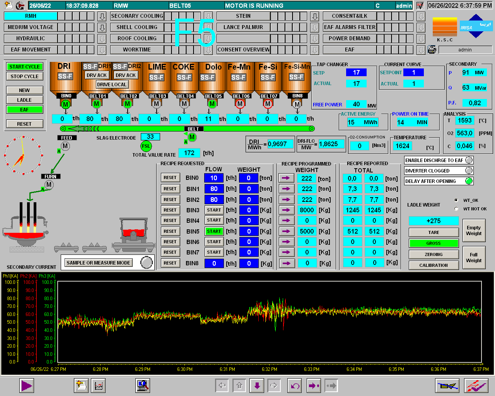
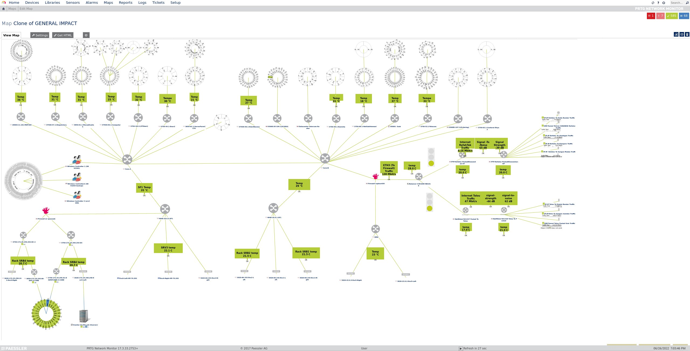

# 📰 Issue 02: Insights from Waterfall-ICS STRIVE Threat Reports and the Cyber Sabotage at Iranian Steel Plants in 2022

In the second issue of the 2025 volume of [Ind.Cyber.Sec Letters](indcybersecletters), the **[2024](2024waterfall-icsstrive) and [2025](2025waterfall-icsstrive) Operational Technology (OT) Cyber Threat Reports** published by [Waterfall Security Solutions](waterfall), in collaboration with [ICS STRIVE](icsstrive), are reviewed. This issue also provides an in-depth analysis of the 2022 cyber sabotage targeting Iran’s [Khouzestan Steel Company (KSC)](khouzestan), [Mobarakeh Steel Company (MSC)](mobarakeh), and [Hormozgan Steel Company (HOSCO)](hosco), which resulted in a fire at one facility and the halting of production lines. The attack was attributed to the threat actor **Predatory Sparrow**.

## 📑 Table of Contents

- [📊 Insights from Waterfall-ICS STRIVE Threat Reports](#-insights-from-waterfall-ics-strive-threat-reports).
- [🕵️‍♂️ Cyber Sabotage at Iranian Steel Plants in 2022](#️️-cyber-sabotage-at-iranian-steel-plants-in-2022).
- [🔍 Supporting Evidences](#-supporting-evidences).
- [📚 References](#-references).

## 📊 Insights from Waterfall-ICS STRIVE Threat Reports

The [2024](2024waterfall-icsstrive) and [2025](2025waterfall-icsstrive) OT Cyber Threat Reports, issued by [Waterfall Security Solutions](waterfall) and [ICS STRIVE](icsstrive), focus specifically on cyberattacks that lead to **physical consequences**, going beyond data breaches or denial-of-service events. Notably, all incidents included in the reports are based on **open-source intelligence (OSINT)**.

  
   
  <em>Figure 01. Overview of the methodology and criteria used for including cyber incidents in the threat reports.</em>

- 💀 **2022**: A total of **57** cyberattacks with physical consequences were reported.
- 💀 **2023**: **68** such incidents were recorded, impacting approximately 500 physical sites.
  - Of these, 37 incidents affected process and discrete manufacturing operations.
    - According to [Waterfall Security Solutions (2024)](#-references), most of these events did not target critical infrastructure, suggesting that such facilities may implement less mature cybersecurity measures compared to sectors such as water and wastewater systems (WWS) and the power sector.
  - In 2023, 11 financial or regulatory disclosures were made in relation to cyber incidents. These public statements were issued either to inform stakeholders or to meet mandatory reporting obligations.
  - ⚠️ Additionally, 2023 saw a nation-state cyberattack with physical consequences: an operation attributed to Iran targeted a small water utility cooperative near Erris, Ireland.
- 💀 **2024**: **76** incidents were recorded that met the inclusion criteria outlined in Figure 01.
  - ⚠️ There was a notable increase in the number of nation-state cyberattacks with physical consequences, with a total of six such incidents. [Waterfall Security Solutions (2025)](2025waterfall-icsstrive) notes that most of these attacks were linked to one of the following geopolitical conflicts:
    - The Russo-Ukrainian war.
    - The Israel–Hamas war (with Iran acting as a proxy).
    - The Western Democracies–China Grey Zone conflict.
- 💀 Ransomware and industrial cyber sabotage continue to rise.
  - 💥 In 2023, ransomware accounted for 80% of all incidents where the threat actor was identified.
  - 💥 In 2024, this percentage rose to 87%.
    - Ransomware groups typically claim that their intent is not to cause physical harm, but rather to extort victims through ransom demands. Common tactics employed by these groups include:
      - 1️⃣ Steal a copy of data.
      - 2️⃣ Encrypting servers, databases, and systems managing operational and business processes.
      - 3️⃣ Demanding payment to prevent public data leaks and to deliver decryption keys required for recovery.
    - Several ransomware groups appear to prioritize data exfiltration.
    - Nonetheless, OT systems have been disabled sometimes as a precautionary measure (leading to operational failures, facility shutdowns, and physical consequences), according to [Waterfall Security Solutions (2024)](#-references).
  - 💥 In 2023, 15% of reported cyber incidents were attributed to hacktivist groups.
    - Unlike ransomware operations, hacktivist campaigns often aim to cause physical disruption, intending to draw attention to political demands or ideological causes.
- Cyber incidents are organized into a dataset and classified based on **whether their impact on OT systems was direct or indirect**. The table below summarizes key findings for the years 2023 and 2024, as reported by [Waterfall Security Solutions (2024, 2025)](#-references).

| Category | Subcategory | Description | 2023 | 2024 |
|---|---|---|---|---|
| **Direct** | On OT | Malware found directly in OT systems or networks | 7 | 4 |
| **Direct** | Poor segmentation | Lateral movement enabled by weak or absent network segmentation | 3 | 0 |
| **Direct** | IT pivot | Initial access through IT systems with subsequent OT impact | 0 | 3 |
| **Direct** | Supply chain | Malware or vulnerabilities inserted into OT software/firmware via supplier | 1 | 1 |
| **Direct** | Malicious insiders | Insider activity with intentional sabotage or compromise | 1 | 0 |
| **Indirect** | Abundance of caution | OT systems shut down for safety, evidence preservation, or external recommendation | 21 | 24 |
| **Indirect** | IT dependency | Business/OT operations disrupted due to IT systems being compromised | 16 | 24 |
| **Indirect** | Third party | Supplier affected by attack, indirectly halting/disrupting victim's operations | 2 | 4 |
| **Unknown** | - | Root cause not disclosed or undetermined | 17 | 16 |
||| **Total** | **68** | **76** |

- In 2023, a total of 12 direct cyberattacks targeting OT systems were recorded.
- In 2024, a total of 8 direct attacks on OT environments were recorded in the dataset.
- A substantial number of indirect attacks occurred due to an **abundance of caution**: 21 in 2023 and 24 in 2024. According to [Waterfall Security Solutions (2024)](#-references), these figures underscore the need to strengthen OT-specific security programs in order to reduce unnecessary operational shutdowns triggered by precautionary measures.
- Additionally, **IT dependency** accounted for a high number of incidents: 16 in 2023 and 24 in 2024. [Waterfall Security Solutions (2024)](#-references) emphasizes the importance of assessing and quantifying both the risk and the extent of dependency on IT systems. Based on this assessment, organizations should prioritize mitigation efforts by either:
  - 👉 Reducing downtime to acceptable levels, or
  - 👉 Fully eliminating the IT dependency where feasible.
- 🛡️ [Waterfall Security Solutions (2025)](#-references) argues that **safety-critical OT networks require significantly higher levels of security and resilience than traditional IT networks**, as they must be designed to withstand all possible inputs and threats scenarios. In contrast, IT networks—due to their continuous exposure to the Internet—cannot be secured to the same degree.
- 🛡️ Finally, the [2024](2024waterfall-icsstrive) report places strong emphasis on the initiative led by the [Idaho National Laboratory (INL)](inl): **Cyber-Informed Engineering (CIE)**. This framework is presented as a critical defensive development for OT systems. It includes a set of guiding questions that engineers and cybersecurity professionals should consider when designing or assessing OT security programs.
  - 🔗 [Cyber-Informed Engineering (CIE)](cie).
- 🛡️ The [2025](2025waterfall-icsstrive) report emphasizes a key recommendation issued by the [Cybersecurity and Infrastructure Security Agency (CISA)](cisa), in collaboration with international authorities: the adoption of **hardware-enforced remote access for high-consequence OT networks**. This approach is presented as a more secure alternative to conventional virtual private network (VPN) solutions and jump hosts.
  - 🔗 [Modern Approaches to Network Access Security](2024cisa).
- 🛡️ The [2025](2025waterfall-icsstrive) report also highlights the release of the **Principles of Operational Technology Cyber Security**, authored by several international government agencies. This document outlines six foundational principles, each accompanied by guiding questions to support decision-making in OT cyber defense strategies. The principles are:
  - 🏰 **Principle 1**: Safety is paramount.
  - 🏰 **Principle 2**: Knowledge of the business is crucial.
  - 🏰 **Principle 3**: OT data is extremely valuable and needs to be protected.
  - 🏰 **Principle 4**: Segment and segregate OT from all other networks.
  - 🏰 **Principle 5**: The supply chain must be secure.
  - 🏰 **Principle 6**: People are essential for OT cyber security.
    - 🔗 [Principles of Operational Technology Cyber Security](principlesotcybersec)

## 🕵️‍♂️ Cyber Sabotage at Iranian Steel Plants in 2022

  
   
  <em>First artwork for Issue 02, Volume 02 of the Ind.Cyber.Sec Letters.</em>

- **Threat group**: Predatory Sparrow (Persian: *Gonjeshke Darande*).
  - 🔗 [Twitter/X](https://x.com/GonjeshkeDarand).
  - 🔗 [Telegram](https://t.me/GonjeshkeDarandeOfficial).
- **Targeted Organizations**:
  - 🧑‍🏭 [Khouzestan Steel Company (KSC)](khouzestan).
  - 🧑‍🏭 [Mobarakeh Steel Company (MSC)](mobarakeh).
  - 🧑‍🏭 [Hormozgan Steel Company (HOSCO)](hosco).
- **Identified Locations**:
  - 🇮🇷 KSC – Khuzestan Province, Iran ([31.27014450917057, 48.732462412324395](https://maps.app.goo.gl/2jCACZ77XHTBwSGX9)).
  - 🇮🇷 MSC Complex – Mobarakeh, Isfahan Province, Iran ([32.247440032570516, 51.42825033362824](https://maps.app.goo.gl/gdGLCRWv7qCrk5WL8)).
- **Date of Main Incident**: June 27, 2022.
- ⭐ **Cyber Incident Tracker for Electric Power Systems (CITEPS)**: [2022PredatorySparrow](citeps) (Category: ☠️ *Critical*).

  
   
  <em>Figure 02. CCTV footage excerpt published by Predatory Sparrow.</em>

- A video (Figure 02) originally published by Predatory Sparrow on June 27, 2022, via Twitter/X and Telegram [(Supporting Evidence 1)](#-supporting-evidences), allegedly captured by a closed-circuit television (CCTV) system, depicts a cyberattack with physical consequences—**specifically, the spill of molten steel onto the factory floor at [KSC](khouzestan)** [(Greenberg, 2024)](#-references). Predatory Sparrow claimed responsibility for the attack, asserting it was conducted in a manner intended to avoid harming workers, although the feasibility of such control remains questionable.
  - Multiple news outlets, including some based in Iran [(Iran Press News, 2022)](#-references), linked the footage to [KSC](khouzestan) [(Supporting Evidence 2)](#-supporting-evidences).
  - The semi-official [Mehr News Agency](mehrnews) [(2022)](#-references) reported statements from Amin Ebrahimi, chief executive officer (CEO) of [KSC](khouzestan), who confirmed the cyberattack but stated that it had been contained. He added that some operations were switched to manual mode, and that the defensive measures prevented disruptions to supply chains and customers [(Debre, 2022)](#-references).
  - It appears that **[KSC](khouzestan)’s production line was indeed halted at the time** [(ICS STRIVE, 2022; The New Arab, 2022; Radiflow, 2022; Tidy, 2022)](#-references). However, conflicting reports suggest the cyberattack may have had limited effect, as the factory was already non-operational due to a power outage [(Supporting Evidence 2](#-supporting-evidences)[; Vicens, 2022)](#-references).
- On the same day (June 27, 2022), Predatory Sparrow released three images allegedly related to the incident [(Supporting Evidence 3)](#-supporting-evidences):
  - A screenshot (Figure 03) of CCTV footage timestamped June 26, 2022, 18:39:22, depicting the same location as in the previously mentioned video.
    - [Supporting Evidence 4](#-supporting-evidences) is a video segment from a news report concerning [KSC](khouzestan). Starting at the 28-second mark (see Figure 04), the video reveals an internal surveillance monitoring setup composed of multiple monitors. The visual format and timestamp positioning exhibit notable similarities to Figures 02 and 03.
  - A screenshot (Figure 05) of a SCADA interface, timestamped June 26, 2022, 18:37:59, featuring the logos of [KSC](khouzestan) and the [International Systems Engineering & Automation Company (IRISA)](irisa), a company headquartered in Isfahan, Iran, that provides industrial automation, IT, and cybersecurity services.
    - [Supporting Evidence 5](#-supporting-evidences) indicates that [KSC](khouzestan) was a client and end-user in an industrial automation project led by [IRISA](irisa), focused on Siemens-based systems.
  - A screenshot (Figure 06) of a network monitoring dashboard from [PRTG Network Monitor](prtg), version 17.3.33.2753+, developed by [PAESSLER](paessler), timestamped June 26, 2022, 19:03:46. The interface displays graphical monitoring of network assets such as routers, switches, firewalls, and wireless controllers.
    - At the time, [PRTG Network Monitor](prtg) had several known vulnerabilities, some of which were rated as high as 9.0 under the common vulnerability scoring system (CVSS) 9.0, as indicated by [Supporting Evidence 6](#-references).

  
   
  <em>Figure 03. Screenshot of CCTV footage released by Predatory Sparrow.</em>

  
   
  <em>Figure 04. Frame captured from Supporting Evidence 04 (YouTube video).</em>

  
   
  <em>Figure 05. Screenshot of a SCADA interface released by Predatory Sparrow.</em>

  
   
  <em>Figure 06. Screenshot of a network monitoring dashboard (PRTG) released by Predatory Sparrow.</em>

- On the same day as the main incident (June 27, 2022), there were reports of IT system outages and disruptions to official websites, see [Supporting Evidence 7](#-references) and other sources [(Debre, 2022; Vicens, 2022)](#-references).
- Beginning on June 7, 2022, Predatory Sparrow also published new images and a video related to the cyber incident on its Twitter/X account (see [Supporting Evidences 8, 9, and 10](#-supporting-evidences)). [Supporting Evidence 10](#-supporting-evidences), in particular, displays an overhead view of the factory floor of one of the targeted companies (see Figure 07). By comparing this image with a frame obtained from [Supporting Evidence 11](#-supporting-evidences), it is confirmed that the factory floor belongs to [MSC](mobarakeh). Figure 08 further illustrates the identification of the [MSC](mobarakeh) logo in frames extracted from [Supporting Evidence 11](#-supporting-evidences).
- Additionally, company data began to leak through file shares hosted on [MEGA](mega), allegedly including internal documents and emails ([Supporting Evidences 12, 13, and 14](#-references)). The apparent motivation behind these leaks was to associate the targeted companies with the Iranian Revolutionary Guard Corps (IRGC). As of now, the publicly accessible links total over **65 GB of data**.

  
   
  <em>Figure 07. Visual comparison between an image—likely a screenshot from CCTV footage—released by Predatory Sparrow, and a frame extracted from a YouTube video (Supporting Evidence 11).</em>

  
   
  <em>Figure 08. Identification of the MSC logo in frames extracted from Supporting Evidence 11.</em>

## 🔍 Supporting Evidences

1. 💬 [@GonjeshkeDarand Twitter/X Post – June 27, 2022a](https://x.com/GonjeshkeDarand/status/1541288345183158272)
2. 💬 [@IranIntl_En Twitter/X Post – June 27, 2022](https://x.com/IranIntl_En/status/1541303774672732160)
3. 💬 [@GonjeshkeDarand Twitter/X Post – June 27, 2022b](https://x.com/GonjeshkeDarand/status/1541257336706170880)
4. 🎬 [YouTube Video](https://youtu.be/rXAuIHaLOPg)
5. 🌐 [IRISA Project Page (Wayback Machine) – January 25, 2024](https://web.archive.org/web/20240125121512/https://www.irisaco.com/en/project-details/project15/)
6. 💬 [@certfalab Twitter/X Post – June 27, 2022](https://x.com/certfalab/status/1541357740345393152)
7. 💬 [@michaelh992 Twitter/X Post – June 27, 2022](https://x.com/michaelh992/status/1541308707560095749)
8. 💬 [@GonjeshkeDarand Twitter/X Post – July 7, 2022a](https://x.com/GonjeshkeDarand/status/1545025047605166085)
9. 💬 [@GonjeshkeDarand Twitter/X Post – July 17, 2022a](https://x.com/GonjeshkeDarand/status/1548569476345778176)
10. 💬 [@GonjeshkeDarand Twitter/X Post – July 17, 2022b](https://x.com/GonjeshkeDarand/status/1548569328680808449)
11. 🎬 [YouTube Video](https://youtu.be/hH4YtwEPUEM)
12. 💬 [@GonjeshkeDarand Twitter/X Post – July 7, 2022b](https://x.com/GonjeshkeDarand/status/1545026927366492165)
13. 💬 [@GonjeshkeDarand Twitter/X Post – July 17, 2022c](https://x.com/GonjeshkeDarand/status/1548566961092644864)
14. 💬 [@GonjeshkeDarand Twitter/X Post – July 19, 2022](https://x.com/GonjeshkeDarand/status/1549424795057520641)

## 📚 References

- Australian Signals Directorate's Australian Cyber Security Centre. (2024). *Principles of Operational Technology Cyber Security*. [Link](https://web.archive.org/web/20250416092511/https://www.cyber.gov.au/sites/default/files/2025-03/Principles%20of%20operational%20technology%20cybersecurity%20(October%202024).pdf)
- Bagwe, M. (2022, June 27). *Iranian Steelmaker Halts Production Following Cyberattack*. BankInfoSecurity. [Link](https://web.archive.org/web/20240719020502/https://www.bankinfosecurity.com/iranian-steelmaker-halts-production-following-cyberattack-a-19465)
- Cybersecurity and Infrastructure Security Agency, Federal Bureau of Investigation, New Zealand's Government Communications Security Bureau, New Zealand's Computer Emergency Response Team, Canadian Centre for Cyber Security. (2024, June 18). *Modern Approaches to Network Access Security*. [Link](https://web.archive.org/web/20250222002424/https://www.cisa.gov/sites/default/files/2024-06/joint-guide-modern-approaches-to-secure-network-access-security-508c.pdf)
- Cyble. (2022, June 29). *Iran's Steel Production Impacted by Cyberattack*. [Link](https://web.archive.org/web/20240203031153/https://cyble.com/blog/irans-steel-production-impacted-by-cyberattack/)
- Debre, I. (2022, June 28). *Large Cyberattack on Iranian Industrial Sector Targets Three Steel Plants*. The Times of Israel. [Link](https://web.archive.org/web/20241108051536/https://www.timesofisrael.com/large-cyberattack-on-iranian-industrial-sector-targets-three-steel-plants/)
- Gooding, M. (2022, June 27). *Iran's Steel Industry Hit by Cyberattack as Tensions with Israel Rise*. Tech Monitor. [Link](https://web.archive.org/web/20250530015411/https://www.techmonitor.ai/technology/cybersecurity/iran-steel-cyberattack-israel?cf-view)
- Greenberg, A. (2024, January 25). *How a Group of Israel-Linked Hackers Has Pushed the Limits of Cyberwar*. WIRED. [Link](https://web.archive.org/web/20250528122423/https://www.wired.com/story/predatory-sparrow-cyberattack-timeline/)
- ICS STRIVE. (2022, June 28). *Khuzestan Steel Among Plants Hit in Cyber Attack: Production Halts*. [Link](https://web.archive.org/web/20240419053336/https://icsstrive.com/incident/khuzestan-steel-hit-in-cyber-attack-production-halts/)
- Iran Press News. (2022, June 27). *فیلم؛ لحظه حمله سایبری به "فولاد" خوزستان را ببینید*. [Link](https://web.archive.org/web/20240428071343/https://www.iranpressnews.com/source/229371.htm)
- ISSSource. (2022, June 27). *Iranian Steel Firm Hit in Attack, Production Stops*. [Link](https://www.isssource.com/iranian-steel-firm-hit-in-attack-production-stops/)
- Mehr News Agency. (2022, June 27). *قطع برق به موقع، فرشته نجات فولادسازان*. [Link](https://web.archive.org/web/20220816002124/https://www.mehrnews.com/news/5525048/%D9%82%D8%B7%D8%B9-%D8%A8%D8%B1%D9%82-%D8%A8%D9%87-%D9%85%D9%88%D9%82%D8%B9-%D9%81%D8%B1%D8%B4%D8%AA%D9%87-%D9%86%D8%AC%D8%A7%D8%AA-%D9%81%D9%88%D9%84%D8%A7%D8%AF%D8%B3%D8%A7%D8%B2%D8%A7%D9%86)
- Radiflow. (2022, June 28). *Behind the News: Cyberattack Forces Iranian State-Owned Steel Plant to Stop Production!*. [Link](https://web.archive.org/web/20250123071755/https://www.radiflow.com/blog/behind-the-news-cyberattack-forces-iranian-state-owned-steel-plant-to-stop-production/)
- The New Arab. (2022, June 27). *Cyberattack Forces Iran Steel Company to Halt Production*. [Link](https://web.archive.org/web/20250124174652/https://www.newarab.com/news/cyberattack-forces-iran-steel-company-halt-production)
- Tidy, J. (2022, July 10). *Predatory Sparrow: Who Are the hackers Who Say They Started a Fire in Iran?*. BBC. [Link](https://web.archive.org/web/20250420160203/https://www.bbc.com/news/technology-62072480)
- Umawing, J. (2022, July 13). *Predatory Sparrow Massively Disrupts Steel Factories While Keeping Workers Safe*. [Link](https://web.archive.org/web/20241230150700/https://www.threatdown.com/blog/predatory-sparrow-massively-disrupts-steel-factories-while-keeping-workers-safe/)
- United States Department of Energy. (2023, August 7). *Cyber-Informed Engineering Implementation Guide* (INL/RPT-23-74072). Office of Cybersecurity, Energy Security, and Emergency Response. [Link](https://web.archive.org/web/20250309232137/https://inldigitallibrary.inl.gov/sites/sti/sti/Sort_67122.pdf)
- Vicens, A. (2022, June 27). *Iranian Steel Facilities Suffer Apparent Cyberattacks*. CyberScoop. [Link](https://web.archive.org/web/20250503092825/https://cyberscoop.com/iran-cyberattack-israel-hacktivist-steel-ics/)
- Waterfall Security Solutions. (2024). *2024 Threat Report*. [Link](2024waterfall-icsstrive)
- Waterfall Security Solutions. (2025). *2025 Threat Report*. [Link](2025waterfall-icsstrive)

## 🔖 Nomenclature

- CCTV: Closed-circuit television.
- CEO: Chief executive officer.
- CVSS: Common vulnerability scoring system.
- VPN: Virtual private network.
- IT: Information technology.
- OSINT: Open-source intelligence.
- OT: Operational technology.
- WWS: Water and wastewater system.

  
   
  <em>Second artwork for Issue 02, Volume 02 of the Ind.Cyber.Sec Letters.</em>

---

*Ind.Cyber.Sec Letters* . Volume 02 . Issue 02 . 2025-05-30

[Prof. Dr. Luiz F. Freitas-Gutierres](https://www.linkedin.com/in/lffreitas-gutierres/)

<!-- Links -->
[2024cisa]: https://web.archive.org/web/20250222002424/https://www.cisa.gov/sites/default/files/2024-06/joint-guide-modern-approaches-to-secure-network-access-security-508c.pdf
[2024waterfall-icsstrive]: https://waterfall-security.com/wp-content/uploads/2024/04/2024-Threat-Report.pdf
[2025waterfall-icsstrive]: https://waterfall-security.com/ot-insights-center/ot-cybersecurity-insights-center/2025-threat-report-ot-cyberattacks-with-physical-consequences
[cie]: https://web.archive.org/web/20250309232137/https://inldigitallibrary.inl.gov/sites/sti/sti/Sort_67122.pdf
[cisa]: https://www.cisa.gov
[citeps]: https://github.com/substationworm/CITEPS/blob/main/CITEPS.md
[icsstrive]: https://icsstrive.com
[indcybersecletters]: https://github.com/substationworm/IndCyberSecLetters
[inl]: https://inl.gov
[irisa]: https://www.irisaco.com
[khouzestan]: https://www.ksc.ir/en/home
[mega]: https://mega.io
[mehrnews]: https://en.mehrnews.com
[mobarakeh]: https://www.msc.ir
[paessler]: https://www.paessler.com
[principlesotcybersec]: https://web.archive.org/web/20250416092511/https://www.cyber.gov.au/sites/default/files/2025-03/Principles%20of%20operational%20technology%20cybersecurity%20(October%202024).pdf
[prtg]: https://www.paessler.com/prtg/prtg-network-monitor
[waterfall]: https://waterfall-security.com
