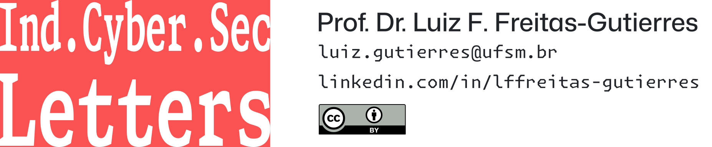

# Ind.Cyber.Sec Letters

**Ind.Cyber.Sec Letters** is a collection of studies and analyses of incidents in the field of industrial cybersecurity.

**Ind.Cyber.Sec Letters** is an initiative linked to university extension/outreach projects coordinated by [Prof. Dr. Luiz F. Freitas-Gutierres](https://www.linkedin.com/in/lffreitas-gutierres/) and conducted at the Federal University of Santa Maria ([UFSM](https://www.ufsm.br/)), in partnership with external institutions:

- [UFSM & [City Hall of Mata](https://www.mata.rs.gov.br/)] [PHISHING001] Strategies for Phishing Attack Prevention and Response: A Training and Simulation Approach ([061488](https://portal.ufsm.br/projetos/publico/projetos/view.html?idProjeto=74219)).
- [UFSM & [CERTAJA](https://www.certajaenergia.com.br/)] [PHISHING003] Strategies for Phishing Attack Prevention and Response: A Training and Simulation Approach ([062423](https://portal.ufsm.br/projetos/publico/projetos/view.html?idProjeto=424425)).

---

*All issues*:

- 2025 - Volume 02
    - [Issue 01](https://github.com/substationworm/IndCyberSecLetters/blob/main/2025/Issue01/Issue01.md): Data Breach at Spanish Water Utility Compromises Sensitive Information.
    - [Issue 02](https://github.com/substationworm/IndCyberSecLetters/blob/main/2025/Issue02/Issue02.md): Insights from Waterfall-ICS STRIVE Threat Reports and the Cyber Sabotage at Iranian Steel Plants in 2022.
    - [CTI-Brief 01](https://github.com/substationworm/IndCyberSecLetters/blob/main/2025/CTI-Brief01.pdf): Your Personal Data and Official Documents Might Be for Sale on the Dark Web - And You Don't Even Know It.
    - [CTI-Brief 02](https://github.com/substationworm/IndCyberSecLetters/blob/main/2025/CTI-Brief02.pdf): Number of Leaked Accounts on the Dark and Deep Web Using the Top 5 Most Common Passwords in Brazil.
    - [CTI-Brief 03](https://github.com/substationworm/IndCyberSecLetters/blob/main/2025/CTI-Brief03.pdf): CyberAv3ngers: Profiling Operational Technology Threat Actors Using StealthMole's Platform.
    - [CTI-Brief 04](https://github.com/substationworm/IndCyberSecLetters/blob/main/2025/CTI-Brief04/CTI-Brief04.md): Notes on FunkSec and an Affiliated Threat Actor.
    - [CTI-Brief 05](https://github.com/substationworm/IndCyberSecLetters/blob/main/2025/CTI-Brief05/CTI-Brief05.md): Profiling a Cybercriminal Linked to Recent Cyber Incidents in Nepal.
- 2024 - Volume 01
    - [Issue 01](https://github.com/substationworm/IndCyberSecLetters/blob/main/2024/Issue01/Issue01.md): Threat Actors Continue to Exploit OT/ICS through Unsophisticated Means.
    - [Issue 02](https://github.com/substationworm/IndCyberSecLetters/blob/main/2024/Issue02/Issue02.md): OpenAI Identifies Threat Actors Using Its AI Models Against Operational Technologies.
    - [Issue 03](https://github.com/substationworm/IndCyberSecLetters/blob/main/2024/Issue03/Issue03.md): Financial Impacts of Ransomware Can Reach Up to US$1 Million in Critical Infrastructure.
    - [Issue 04](https://github.com/substationworm/IndCyberSecLetters/blob/main/2024/Issue04/Issue04.md): Weak Passwords and Poor Security Practices Persist After Six Years of NordPass Research.
    - [Issue 05](https://github.com/substationworm/IndCyberSecLetters/blob/main/2024/Issue05/Issue05.md#compromised-it-systems): The State of ICS/OT Cybersecurity in 2024 According to the SANS Institute.